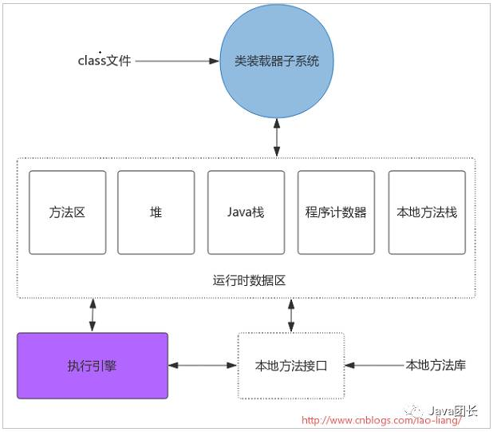
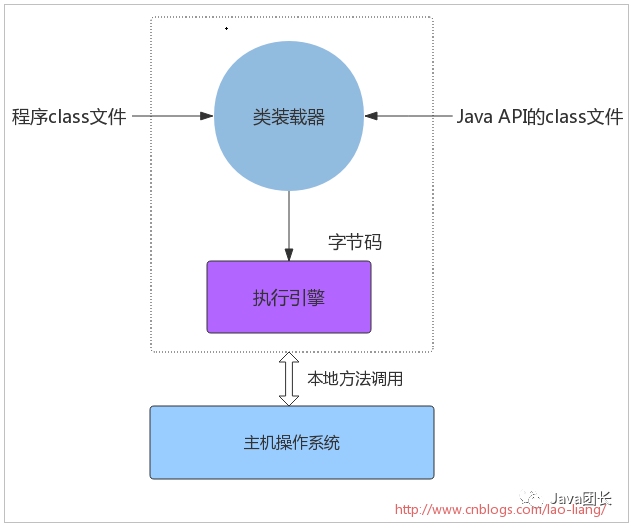

###JVM组成结构
类加载子系统（ClassLoader）

运行数据区域（Runtime Data Area）

执行引擎（Execute Engine）

###java虚拟机
Java虚拟机的主要任务是装载class文件并且执行其中的字节码。

由下图可以看出

Java虚拟机包含一个类装载器（class loader），它可以从程序和API中装载class文件，Java API中只有程序执行时需要的类才会被装载，字节码由执行引擎来执行。

当Java虚拟机由主机操作系统上的软件实现时，Java程序通过调用本地方法和主机进行交互。Java方法由Java语言编写，编译成字节码，存储在class文件中。本地方法由C/C++/汇编语言编写，编译成和处理器相关的机器代码，存储在动态链接库中，格式是各个平台专有。所以本地方法是联系Java程序和底层主机操作系统的连接方式。
