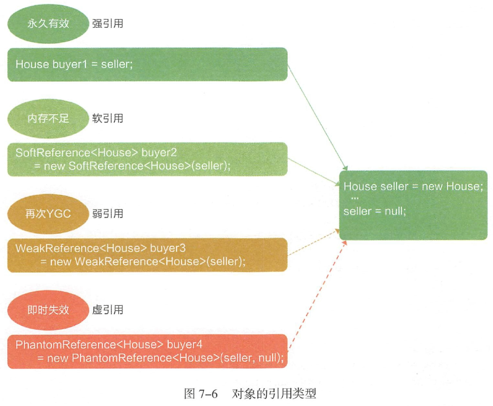

###四种引用类型
* 强引用（Strong Reference）
    - 在程序代码中普遍存在的，只要强引用还存在，GC永远不会回收掉被引用的对象
    - 如果想中断强引用和某个对象之间的关联，可以显示地将引用赋值为null，这样一来的话，JVM在合适的时间就会回收该对象。

* 软引用（Soft Reference）
    - 用来描述一些还有用但并非必需的对象，在系统将要发生内存溢出异常之前，将会
把这些对象列进回收范围之中进行第二次回收
    - 主要用来缓存服务器中间计算结果及不需要实时保存的用户行为等

* 弱引用（Weak Reference）
    - 用来描述非必需对象的，但是它的强度比弱引用更弱一些，被弱引用关联的对象只能生存
到下一次垃圾收集发生之前，当垃圾回收器工作时，无论当前内存是否足够，都会回收只被
弱引用关联的对象
    - 主要用于指向某个易消失的对象，在强引用断开后，此引用不会劫持对象。调用WeakReference.
     get（）可能返回null ，要注意空指针异常。
    - Weak Reference 典型的应用是在WeakHashMap 中
    - WeakHashMap 适用于缓存不敏感的临时信息的场景。例如，用户登录系统后的浏览
      路径在关闭浏览器后可以自动清空。
      
* 虚引用 （Phantom Reference）
    - 最弱的一种引用关系，一个对象是否有虚引用的存在，完全不会对其生存时间构成
影响，也无法通过虚引用取得一个对象实例。对一个对象设置虚引用关联的唯一目的就是能在
这个对象被收集器回收时收到一个系统通知

- 举个具体例子， 在房产交易市场中，某个卖家有一套房子，成功出售给某个买
家后引用置为null 。这里有4个买家使用4 种不同的引用关系指向这套房子。买家
buyer1是强引用，如果把seller引用赋值给它，则永久有效，系统不会因为seller=null
就触发对这套房子的回收， 这是房屋交易市场最常见的交付方式。买家buyer2 是软
引用，只要不产生OOM , buyer2.get（）就可以获取房子对象，就像房子是租来的一样。
买家buyer3 是弱引用，一旦过户后，seller置为null, buyer3的房子持有时间估计只
有几秒钟，卖家只是给买家做了一张假的房产证，买家高兴了几秒钟后，发现房子已
经不是自己的了。buyer4是虚引用，定义完成后无法访问到房子对象，卖家只是虚构
了房源，是空手套白狼的诈骗术。

- Java中提供这四种引用类型主要有两个目的：

    - 第一是可以让程序员通过代码的方式决定某些对象的生命周期；

    - 第二是有利于JVM进行垃圾回收。

- 除强引用外，其他三种引用可以减少对象在生命周期中所占用的内存大小。如果
  控制得当，垃圾回收就能够随意地释放这些对象。如果使用了这些引用，就应该像示
  例中的seller 一样，为避免强引用劫持，把强引用置为null ，否则这三种引用就无法
  发挥它们的价值。
  
- 这三者的使用成本是偏大的，开发工程师应该多去考虑如何不造成
  内存泄漏，如何提升性能，使方法快速执行完成后形成自然回收。如果这些引用在程
  序中使用不当，就会造成更大的风险。