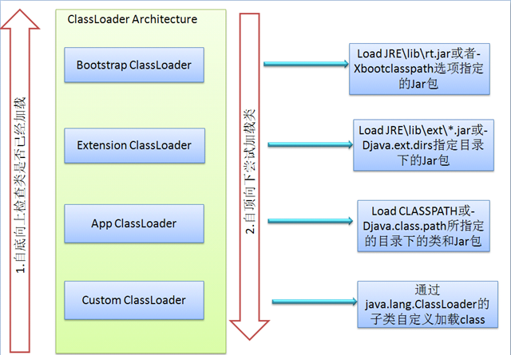

###Java类加载机制
- 虚拟机把描述类的数据文件（字节码）加载到内存，并对数据进行验证、准备、解析以及类初始化，最终形成可以被虚拟机直接使用的java类型（java.lang.Class对象）

####类加载的生命周期
* 加载
    * 通过一个类的全限定名来获取定义此类的二进制字节流
    * 将这个字节流所代表的静态存储结构转化为方法区的运行时数据结构
    * 在内存中生成一个代表这个类的Class对象，作为方法区这个类的各种数据的访问入口
* 验证
    * 文件格式验证
    * 元数据验证
    * 字节码验证
    * 符号引用验证
* 准备
    * 为类变量分配内存并设置类变量初始值
    * static变量会被初始化为数据类型的零值
    * static final修饰的变量会直接被赋值，因为该值被存放在ConstantValue属性中
* 解析
    * 将常量池内的符号引用替换为直接引用的过程
* 初始化
    * 初始化阶段是执行类构造器<clinit>()方法的过程
    * <clinit>()方法是由编译期自动收集类中的所有类变量的赋值动作和静态代码块中的语句合并
    产生的
    * 虚拟机会保证子类的<clinit>()方法执行之前，父类的<clinit>()方法已经执行完毕
    * <clinit>()方法对于类或接口并不是必需的，如果一个类中没有静态语句块，也没有对变量
    的赋值操作，那么编译器可以不为这个类生成<clinit>()方法
    * 执行接口的<clinit>()方法不需要先执行父接口的<clinit>()方法。只有当父接口中定义的
    变量使用时，父接口才会初始化；接口实现类在初始化时也一样不会执行接口的<clinit>()方法
    * 虚拟机会保证一个类的<clinit>()方法在多线程环境中被正确地加锁、同步，即类初始化
    是线程安全的
> 注意
>> * 对于静态字段，只有直接定义这个字段的类才会被初始化，即通过子类引用父类的静态子段
不会导致子类初始化
>> * 通过数组定义来引用类，不会触发此类的初始化
>> * 常量(static final修饰)在编译阶段会存入调用类的常量池中，本质上并没有直接引用到
定义变量的类，因此不会触发定义常量的类的初始化
>> * 编译器也会为接口生成<clinit>()方法，用于初始化接口中所定义的成员变量，但是一个
接口在初始化时，并不要求其父接口全部都要完成初始化，只有在真正使用到父接口的时候才会
初始化
####类加载器
JVM 的类加载是通过 ClassLoader 及其子类来完成

* 三种类加载器
    * 启动类加载器
    * 扩展类加载器
    * 应用程序类加载器

- 双亲委托机制

类加载器采用双亲委派模型工作，如果一个类加载器收到一个类加载的请求，它首先将这个请求委派给父类加载器去完成，每一个层次类加载器都是如此，则所有的类加载请求都会传送到顶层的启动类加载器，只有父加载器无法完成这个加载请求(即它的搜索范围中没有找到所要的类)，子类才尝试加载。

特点:

1. 从子到父共享缓存
2. 从父到子尝试自加载

双亲委托机制的作用：

1. 共享功能：可以避免重复加载，当父亲已经加载了该类的时候，子类不需要再次加载，一些Framework层级的类一旦被顶层的ClassLoader加载过就缓存在内存里面，以后任何地方用到都不需要重新加载。

2. 隔离功能：安全角度考虑，防止用户自定义类加载器替代Java的核心API,因为String已经在启动时被加载，所以用户自定义类是无法加载一个自定义的类装载器，保证java/Android核心类库的纯净和安全，防止恶意加载。

###引起类加载操作的五个行为
遇到new、getstatic、putstatic或invokestatic这四条字节码指令

反射调用的时候，如果类没有进行过初始化，则需要先触发其初始化

子类初始化的时候，如果其父类还没初始化，则需先触发其父类的初始化

虚拟机执行主类的时候(有 main(string[] args))

JDK1.7 动态语言支持

###Java对象创建时机
使用new关键字创建对象

使用Class类的newInstance方法(反射机制)

使用Constructor类的newInstance方法(反射机制)

使用Clone方法创建对象

使用(反)序列化机制创建对象