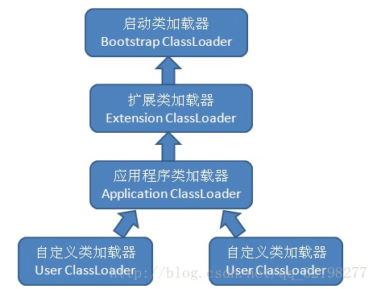
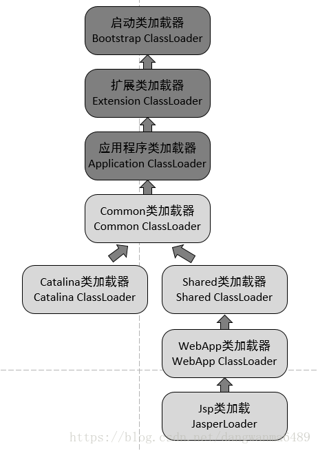

###Java类加载机制
- 虚拟机把描述类的数据从Class文件加载到内存，并对数据进行验证、准备、解析以及类初始化，最终形成可以被虚拟机直接使用的java类型（java.lang.Class对象）

####类加载的生命周期
* 加载
    * 通过一个类的全限定名来获取定义此类的二进制字节流
    * 将这个字节流所代表的静态存储结构转化为方法区的运行时数据结构
    * 在内存中生成一个代表这个类的Class对象，作为方法区这个类的各种数据的访问入口
* 验证
    * 这一阶段的目的是为了确保Class文件的字节流中包含的信息符合当前虚拟机的要求
    * 文件格式验证
    * 元数据验证
    * 字节码验证
    * 符号引用验证
* 准备
    * 正式为变量分配内存并设置初始值，这些内存都将在方法区中进行分配，这里的变量仅包括类标量不包括实例变量
    * 为类变量分配内存并设置类变量初始值
    * static变量会被初始化为数据类型的零值
    * static final修饰的变量会直接被赋值，因为该值被存放在ConstantValue属性中
* 解析
    * 将常量池内的符号引用替换为直接引用的过程
        * 符号引用：符号引用以一组符号来描述所引用的目标，符号可以是任意形式的字面量，只要使用时能无歧义地定位到目标即可。符号引用与虚拟机实现的内存布局无关，引用的目标并不一定已经加载到内存中。
        * 直接引用：直接引用可以是直接指向目标的指针，相对偏移量或是一个能间接定位到目标的句柄。直接引用是与内存布局相关的。
          
* 初始化
    * 初始化阶段是执行类构造器<clinit>()方法的过程
    * <clinit>()方法是由编译期自动收集类中的所有类变量的赋值动作和静态代码块中的语句合并
    产生的
    * 虚拟机会保证子类的<clinit>()方法执行之前，父类的<clinit>()方法已经执行完毕
    * <clinit>()方法对于类或接口并不是必需的，如果一个类中没有静态语句块，也没有对变量
    的赋值操作，那么编译器可以不为这个类生成<clinit>()方法
    * 执行接口的<clinit>()方法不需要先执行父接口的<clinit>()方法。只有当父接口中定义的
    变量使用时，父接口才会初始化；接口实现类在初始化时也一样不会执行接口的<clinit>()方法
    * 虚拟机会保证一个类的<clinit>()方法在多线程环境中被正确地加锁、同步，即类初始化
    是线程安全的
> 注意
>> * 对于静态字段，只有直接定义这个字段的类才会被初始化，即通过子类引用父类的静态子段
不会导致子类初始化
>> * 通过数组定义来引用类，不会触发此类的初始化
>> * 常量(static final修饰)在编译阶段会存入调用类的常量池中，本质上并没有直接引用到
定义变量的类，因此不会触发定义常量的类的初始化
>> * 编译器也会为接口生成<clinit>()方法，用于初始化接口中所定义的成员变量，但是一个
接口在初始化时，并不要求其父接口全部都要完成初始化，只有在真正使用到父接口的时候才会
初始化
####类加载器
JVM 的类加载是通过 ClassLoader 及其子类来完成

* 类加载器的层级结构
    * 启动类加载器
    * 扩展类加载器
    * 应用程序类加载器
    * 自定义类加载器
    

- 双亲委托机制

类加载器采用双亲委派模型工作，如果一个类加载器收到一个类加载的请求，它首先将这个请求委派给父类加载器去完成，每一个层次类加载器都是如此，则所有的类加载请求都会传送到顶层的启动类加载器，只有父加载器无法完成这个加载请求(即它的搜索范围中没有找到所要的类)，子类才尝试加载。

特点:

1. 从子到父共享缓存
2. 从父到子尝试自加载

双亲委托机制的作用：

1. 共享功能：可以避免重复加载，当父亲已经加载了该类的时候，子类不需要再次加载，一些Framework层级的类一旦被顶层的ClassLoader加载过就缓存在内存里面，以后任何地方用到都不需要重新加载。

2. 隔离功能：安全角度考虑，防止用户自定义类加载器替代Java的核心API,因为String已经在启动时被加载，所以用户自定义类是无法加载一个自定义的类装载器，保证java/Android核心类库的纯净和安全，防止恶意加载。

###双亲委派模型的破坏

- 第一次：在双亲委派模型出现之前—–即JDK1.2发布之前。 
- 第二次：是这个模型自身的缺陷导致的。我们说，双亲委派模型很好的解决了各个类加载器的基础类的统一问题（越基础的类由越上层的加载器进行加载），基础类之所以称为“基础”，是因为它们总是作为被用户代码调用的API， 但没有绝对，如果基础类调用会用户的代码怎么办呢？

这不是没有可能的。一个典型的例子就是JNDI服务，JNDI现在已经是Java的标准服务，它的代码由启动类加载器去加载（在JDK1.3时就放进去的rt.jar）,但它需要调用由独立厂商实现并部署在应用程序的ClassPath下的JNDI接口提供者（SPI， Service Provider Interface）的代码，但启动类加载器不可能“认识“这些代码啊。因为这些类不在rt.jar中，但是启动类加载器又需要加载。怎么办呢？

为了解决这个问题，Java设计团队只好引入了一个不太优雅的设计：线程上下文类加载器（Thread Context ClassLoader）。这个类加载器可以通过java.lang.Thread类的setContextClassLoader方法进行设置。如果创建线程时还未设置，它将会从父线程中继承一个，如果在应用程序的全局范围内都没有设置过多的话，那这个类加载器默认即使应用程序类加载器。

嘿嘿，有了线程上下文加载器，JNDI服务使用这个线程上下文加载器去加载所需要的SPI代码，也就是父类加载器请求子类加载器去完成类加载的动作，这种行为实际上就是打通了双亲委派模型的层次结构来逆向使用类加载器，实际上已经违背了双亲委派模型的一般性原则。但这无可奈何，Java中所有涉及SPI的加载动作基本都采用这种方式。例如JNDI，JDBC，JCE，JAXB，JBI等。

- 第三次：为了实现热插拔，热部署，模块化，意思是添加一个功能或减去一个功能不用重启，只需要把这模块连同类加载器一起换掉就实现了代码的热替换。

###Tomcat 如何实现自己独特的类加载机制？

我们看到，前面3个类加载和默认的一致，CommonClassLoader、CatalinaClassLoader、SharedClassLoader和WebappClassLoader则是Tomcat自己定义的类加载器，它们分别加载/common/*、/server/*、/shared/*（在tomcat 6之后已经合并到根目录下的lib目录下）和/WebApp/WEB-INF/*中的Java类库。其中WebApp类加载器和Jsp类加载器通常会存在多个实例，每一个Web应用程序对应一个WebApp类加载器，每一个JSP文件对应一个Jsp类加载器。

- commonLoader：Tomcat最基本的类加载器，加载路径中的class可以被Tomcat容器本身以及各个Webapp访问；
- catalinaLoader：Tomcat容器私有的类加载器，加载路径中的class对于Webapp不可见；
- sharedLoader：各个Webapp共享的类加载器，加载路径中的class对于所有Webapp可见，但是对于Tomcat容器不可见；
- WebappClassLoader：各个Webapp私有的类加载器，加载路径中的class只对当前Webapp可见；

- CommonClassLoader能加载的类都可以被Catalina ClassLoader和SharedClassLoader使用，从而实现了公有类库的共用，而CatalinaClassLoader和Shared ClassLoader自己能加载的类则与对方相互隔离。
 
- WebAppClassLoader可以使用SharedClassLoader加载到的类，但各个WebAppClassLoader实例之间相互隔离。
 
- 而JasperLoader的加载范围仅仅是这个JSP文件所编译出来的那一个.Class文件，它出现的目的就是为了被丢弃：当Web容器检测到JSP文件被修改时，会替换掉目前的JasperLoader的实例，并通过再建立一个新的Jsp类加载器来实现JSP文件的HotSwap功能。

###引起类加载操作的五个行为
遇到new、getstatic、putstatic或invokestatic这四条字节码指令

反射调用的时候，如果类没有进行过初始化，则需要先触发其初始化

子类初始化的时候，如果其父类还没初始化，则需先触发其父类的初始化

虚拟机执行主类的时候(有 main(string[] args))

JDK1.7 动态语言支持

###Java对象创建时机
使用new关键字创建对象

使用Class类的newInstance方法(反射机制)

使用Constructor类的newInstance方法(反射机制)

使用Clone方法创建对象

使用(反)序列化机制创建对象