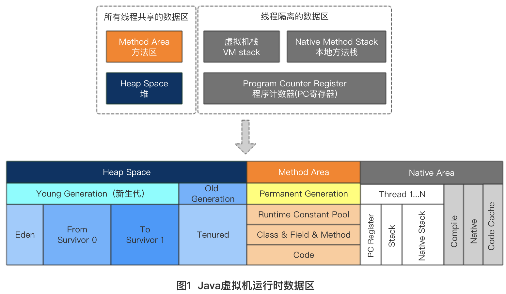

##JVM内存区域

###程序计数器
当前线程所执行的字节码的行号指示器，用于记录正在执行的虚拟机字节指令地址，

线程私有

注：如果正在执行的是Native方法，计数器值则为空

字节码解释器工作时就是改变这个计数器的值来选取下一条需要执行的字节码指令，
分支、循环、跳转、异常处理和线程恢复等功能都需要依赖这个计数器完成。
每个线程都需要有一个独立的程序计数器。
此内存区域是唯一一个在Java虚拟机规范中没有规定任何OOM情况的区域。
###Java虚拟机栈
存放基本数据类型、对象的引用、方法出口等

线程私有。
虚拟机栈描述的是Java方法执行的内存模型：

每个方法在执行的同时都会创建一个栈帧，用于存储局部变量表、操作数栈、动态链接和方法
出口等信息。

局部变量表存放了编译期可知的各种基本数据类型（int,short,boolean,char,long,double,byte,float）和对象引用
###本地方法栈
和Java虚拟机栈类似，只不过本地方法栈是为虚拟机使用到的Native方法服务。

###Java堆
线程共享

Java堆是Java虚拟机所管理的内存中最大的一块，是被所有线程共享的一块内存区域。
所有对象实例、数组都存放在java堆，GC回收的地方，
此内存区域的唯一目的就是存放对象实例，几乎所有实例都在这里分配内存。

堆划分为新生代和旧生代

新生代又被进一步划分为Eden和Survivor区，最后Survivor由From和To组成，新建的对象都是用新生代的Eden分配内存，Eden空间不足的时候，会把存活的对象转移到Survivor中，新生代大小可以由-Xmn来控制，也可以用-XX:SurvivorRatio来控制Eden和Survivor的比例旧生代。eden,from ,to的默认比例是8：1：1

###方法区
存放已被加载的类信息、常量、静态变量、即时编译器编译后的代码数据等。

对于HotSpot虚拟机，方法区对应为永久代(Permanent Generation)

回收目标主要是常量池的回收和类型的卸载，各线程共享

通过反射获取到的类名、方法名、字段名称、访问修饰符等信息都是从这块区域获取的。

用于存储已被虚拟机加载的类信息、常量、静态变量、即时编译期编译后的代码等数据。
* 运行时常量池

是方法区的一部分，用于存放编译期生成的各种字面量和符号引用。

###直接内存
并不是虚拟机运行时内存的一部分，也不是Java虚拟机规范中定义的内存区域，但是这部分内存也被频繁使用。在JDK1.4中加入了NIO类，引入了一种基于通道与缓冲区
的I/O方式，它可以使用Native函数库直接分配堆外内存，然后用过一个存储在Java堆中的DirectByteBuffer对象作为这块内存的引用进行
操作。
本机直接内存的分配不会受到Java堆的限制，但是会受到本机总内存的限制。
###Java普通对象的创建
虚拟机遇到一条new指令时，首先将去检查这个指令的参数是否能在常量池中定位到一个类的符号引用，并且检查这个符号引用代表的类是否已
被加载、解析和初始化过，如果没有，那必须先执行相应的类加载过程；
在类加载检查通过之后，接下来虚拟机将为新对象分配内存。对象所需内存大小在类加载完成后便可以确定。
“指针碰撞”：假设Java堆中内存是绝对规整的，所有用过的内存都放在一边，空闲的内存放在另一边，中间放着一个指针作为分界点的
指示器，那么分配内存就是把那个指针向空闲空间那边挪动一段与对象大小相等的距离
“空闲列表”：如果Java堆中的内存并不是规整的，已使用的内存和空闲内存相互交错，虚拟机就必须维护一个列表，记录上哪些内存块是可用的，
在分配的时候从列表中找到一块足够大的空间划分给给对象实例，并更新列表记录。
划分可用空间之外，还需要考虑一个问题，创建对象在虚拟机中是十分频繁的行为，即使是修改一个指针所指向的位置，在并发情况下也不是线程
安全的，可能出现正在给对象A分配内存，指针还没来得及修改，对象B又同时使用了原来的指针来分配内存的情况。
解决方案：
* 对分配内存空间的动作进行同步处理，采用CAS配上失败重试的方式保证更新操作的原子性
* 把内存分配的动作按照线程划分到在不同的空间之中进行，即每个线程在Java堆中预先分配一小块内存，称为本地线程分配缓冲（TLAB）
哪个线程要分配内存，就在哪个线程的TLAB上分配，只有TLAB用完并分配新的TLAB时，才需要同步锁定。
内存分配完成后，虚拟机需要将分配到的内存空间都初始化为零值，这一操作保证了对象的实例字段在Java代码中可以不赋初值就可以直接
使用。
接下来虚拟机会对对象进行必要的设置，例如这个对象是哪个类的实例，对象的哈希吗，对象的GC分代年龄等信息，这些信息都存放在对象头中。
至此，从虚拟机的角度来看，一个新的对象已经产生了，但从Java程序的角度来看，对象创建才刚刚开始，<init>方法还没有执行。所以，随后
会执行<init>方法，按照程序员的意愿进行初始化。
###对象的内存布局
3块区域：对象头，实例数据，对齐填充
* 对象头：包括两部分信息，第一部分是用于存储对象自身的运行时数据，第二部分是类型指针
运行时数据包括哈希码，GC分代年龄，锁状态标志，线程持有的锁，偏向线程ID，偏向时间戳。“Mark World”
类型指针即对象指向它的类元素数据，虚拟机通过这个指针来确定这个对象是哪个类的实例。并不是所有虚拟机实现都必须在对象上保留类型
指针，即查找对象并不一定要经过对象本身。另外，如果对象是一个数组，那在对象头中还必须有一块用于记录数组长度的数据。
* 实例数据：是对象真正存储的有效信息，也是在程序代码中定义各种类型的字段内容。包括从父类中继承下来的，以及子类中定义的，都
需要记录下来。
* 对齐填充
仅仅起到占位符的作用，虚拟机内存管理系统要求对象起始地址必须是8字节的整数倍，即对象的大小必须8字节的整数倍。
###对象的访问定位
使用句柄和直接指针
使用句柄：Java堆中将会划分出一块内存来作为句柄池，Java栈局部变量表中reference存储的就是对象的句柄地址，而句柄包含了对象实例数据
和类型数据各自的地址信息。
使用直接指针，即实例对象对象头中的类型指针存放的就是类型数据的地址，reference中存储的就是实例对象地址。
两种方式对比：使用句柄的最大好处就是reference中存储的是稳定的句柄地址，在对象移动（垃圾收集时移动对象非常普遍）时，只会改变
句柄中的实例数据指针；直接指针的最大好处就是速度最快，节省了一次指针定位的时间开销。

###异常：StackOverflow和OutOfMemory
StackOverflow：线程请求的栈深度大于虚拟机所允许的深度；
OutOfMemory：虚拟机栈动态扩展时无法申请到足够内存。

###JVM参数设置
-Xmx 设置堆的最大值
-Xms 设置堆的最小值
-Xss 设置栈容量大小
-Xmn 设置新生代大小
-XX:NewRatio 老年代与新生代的比值（2:1）
-XX:SurvivorRatio Eden与Survivor区的比值（8:1）
-XX:MaxDirectMemorySize 设置直接内存大小
-XX:MetaSpaceSize 设置永生代大小
-XX:HeapDumpOutOfMemoryError OOM错误时打印快照
 