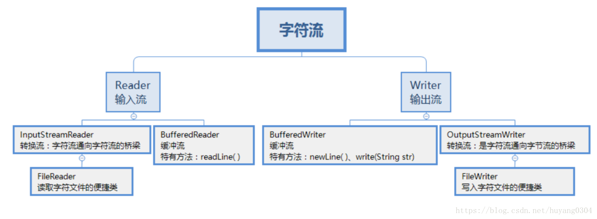

###IO流概念
- IO流用来处理设备之间的数据传输，Java对数据的操作是通过流的方式，Java用于操作流的类都在IO包中

###分类
- 按照流的方向:输入流(inputStream)和输出流(outputStream)。

- 按照实现功能分:节点流(可以从或向一个特定的地方(节点)读写数据。如 FileReader)和处理流(是对一个 已存在的流的连接和封装，通过所封装的流的功能调用实现数据读写。如 BufferedReader。处理流的构造方法总是要 带一个其他的流对象做参数。一个流对象经过其他流的多次包装，称为流的链接。)
- 按照处理数据的单位:字节流和字符流。字节流继承于 InputStream 和 OutputStream，字符流继承于 InputStreamReader 和 OutputStreamWriter。




- 字节输入流转字符输入流通过 InputStreamReader 实现，该类的构造函数可以传入 InputStream 对象。 
- 字节输出流转字符输出流通过 OutputStreamWriter 实现，该类的构造函数可以传入 OutputStream 对象。

- InputStream 是所有的输入字节流的父类，它是一个抽象类。
  ByteArrayInputStream、StringBufferInputStream、FileInputStream 是三种基本的介质流，它们分别从Byte 数组、StringBuffer、和本地文件中读取数据。PipedInputStream 是从与其它线程共用的管道中读取数据，

- OutputStream 是所有的输出字节流的父类，它是一个抽象类。
  ByteArrayOutputStream、FileOutputStream是两种基本的介质流，它们分别向Byte 数组、和本地文件中写入数据。PipedOutputStream 是向与其它线程共用的管道中写入数据

- 缓冲流：BufferedInputStrean 、BufferedOutputStream、 BufferedReader、 BufferedWriter 增加缓冲功能，避免频繁读写硬盘。

- 数据流： DataInputStream 、DataOutputStream 等-提供将基础数据类型写入到文件中，或者读取出来。

###如何将一个 java 对象序列化到文件里
- 在 java 中能够被序列化的类必须先实现 Serializable 接口，该接口没有任何抽象方法只是起到一个标记作用，即标识接口。
- 假设User类已经实现了Serializable接口：
```$xslt
//对象输出流
ObjectOutputStream objectOutputStream = new ObjectOutputStream(new FileOutputStream(new File("D://obj"))); 
objectOutputStream.writeObject(new User("zhangsan", 100));
objectOutputStream.close();
//对象输入流
ObjectInputStream objectInputStream = new ObjectInputStream(new FileInputStream(new File("D://obj")));
User user = (User)objectInputStream.readObject();
System.out.println(user);
objectInputStream.close();

```

###字节流和字符流的区别
- 字节流可以处理所有类型数据，8位字节，如:图片，MP3，AVI 视频文件，
- 而字符流只能处理字符数据。16位字符
- 只要是处理纯文本数据，就要优先考虑使用字符流，
- 除此之外都用字节流。


- 结论：优先选用字节流。首先因为硬盘上的所有文件都是以字节的形式进行传输或者保存的，包括图片等内容。但是字符只是在内存中才会形成的，所以在开发中，字节流使用广泛。

###字节缓冲输入流和字节缓冲输出流
- 字节流一次读写一个数组的速度明显比一次读写一个字节的速度快很多，这是加入了数组这样的缓冲区效果。java本身在设计的时候，也考虑到了这样的设计思想(装饰设计模式)，所以提供了字节缓冲区流。
    - 字节缓冲输出流：BufferedOutputStream
    
    - 字节缓冲输入流：BufferedInputStream  传递的是输入输出流对象而不是文件对象

- 字节缓冲区流仅仅提供缓冲区，为高效而设计的。但是，真正的读写操作还得靠基本的流对象实现。

```$xslt
BufferedInputStream bis = new BufferedInputStream(new FileInputStream("bos.txt"));
byte[] bys = new byte[1024];
int len = 0;
while ((len = bis.read(bys)) != -1) {
    System.out.print(new String(bys, 0, len));
}
bis.close();

```

###如何实现对象克隆
1. 实现 Cloneable 接口并重写 Object 类中的 clone()方法;
2. 实现 Serializable 接口，通过对象的序列化和反序列化实现克隆，可以实现真正的深度克隆

###什么是 java 序列化，如何实现 java 序列化
- 序列化就是一种用来处理对象流的机制，所谓对象流也就是将对象的内容进行流化。可以对流化后的对象进行读 写操作，也可将流化后的对象传输于网络之间。序列化是为了解决在对对象流进行读写操作时所引发的问题。
- 序列化的实现:将需要被序列化的类实现 Serializable 接口，该接口没有需要实现的方法， implements Serializable 只是为了标注该对象是可被序列化的，然后使用一个输出流(如:FileOutputStream)来构造一个 ObjectOutputStream(对象流)对象，接着，使用 ObjectOutputStream 对象的 writeObject(Object obj)方法就 可以将参数为 obj 的对象写出(即保存其状态)，要恢复的话则用输入流。
