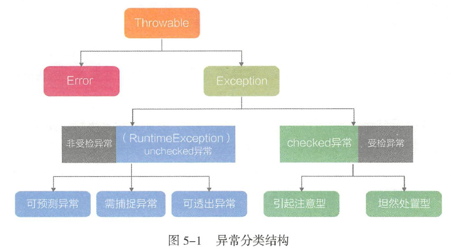

###异常分类

try-catch-finally 是处理程序异常的三部曲。当存在try时，可以只有catch 代码块，
也可以只有finally 代码块，就是不能单独只有try这个光杆司令。

-  try代码块监视代码执行过程， 旦发现异常则直接跳转至catch ，如果
没有catch ，则直接跳转至finally 。

-  catch代码块可选执行的代码块，如果没有任何异常发生则不会执行，如
果发现异常则进行处理或向上抛出。这一切都在catch 代码块中执行。

-  finally代码块必选执行的代码块，不管是否有异常产生，即使发生
OutOfMemoryError也会执行， 通常用于处理善后清理工作。如果finally 代码块没有
执行，那么有三种可能·
    - 没有进入try代码块。
    - 进入try代码块， 但是代码运行中出现了死循环或死锁状态。
    - 进入try代码块， 但是执行了System. exit（） 操作。
    
- Lock 、ThreadLocal 、InputStream 等这些需要进行强制释放和清除的对象都得在
  finally 代码块中进行显式的清理， 避免产生内存泄漏，或者资源消耗。
  
