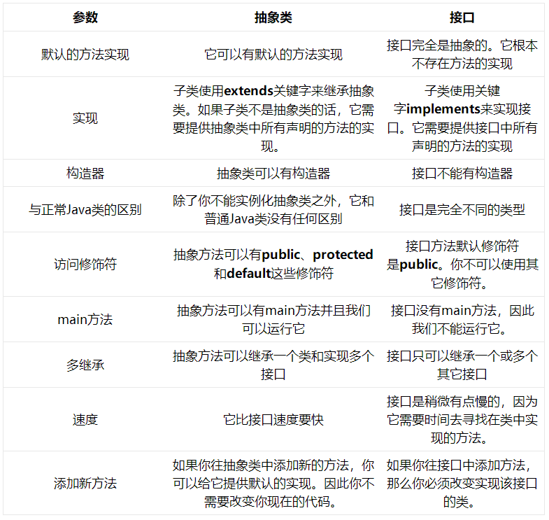

#抽象类和接口的区别
[参考](http://www.importnew.com/12399.html)

####抽象类
- 抽象类是用来捕捉子类的通用特性的 。它不能被实例化，只能被用作子类的超类。
- 抽象类是被用来创建继承层级里子类的模板
- 抽象类是模板式设计，而接口是契约式设计

```aidl
public abstract class GenericServlet implements Servlet, ServletConfig, Serializable {
    // abstract method
    abstract void service(ServletRequest req, ServletResponse res);
 
    void init() {
        // Its implementation
    }
    // other method related to Servlet
}

当HttpServlet类继承GenericServlet时，它提供了service方法的实现：


public class HttpServlet extends GenericServlet {
    void service(ServletRequest req, ServletResponse res) {
        // implementation
    }
 
    protected void doGet(HttpServletRequest req, HttpServletResponse resp) {
        // Implementation
    }
 
    protected void doPost(HttpServletRequest req, HttpServletResponse resp) {
        // Implementation
    }
 
    // some other methods related to HttpServlet
}
```


####接口
- 接口是抽象方法的集合。如果一个类实现了某个接口，那么它就继承了这个接口的抽象方法。
- 这就像契约模式，如果实现了这个接口，那么就必须确保使用这些方法。
- 接口只是一种形式，接口自身不能做任何事情

```aidl
public interface Externalizable extends Serializable {
 
    void writeExternal(ObjectOutput out) throws IOException;
 
    void readExternal(ObjectInput in) throws IOException, ClassNotFoundException;
}

当你实现这个接口时，你就需要实现上面的两个方法：

public class Employee implements Externalizable {
 
    int employeeId;
    String employeeName;
 
    @Override
    public void readExternal(ObjectInput in) throws IOException, ClassNotFoundException {
        employeeId = in.readInt();
        employeeName = (String) in.readObject();
 
    }
 
    @Override
    public void writeExternal(ObjectOutput out) throws IOException {
 
        out.writeInt(employeeId);
        out.writeObject(employeeName);
    }
}

```

####区别



####共同点
- 是对实体类进行更高层次的抽象，都不能被实例化，但可以定义引用变量指向实例变量
- 接口和抽象类都可以包含抽象方法，实现接口或继承抽象类的普通子类都必须实现这些抽象方法。
