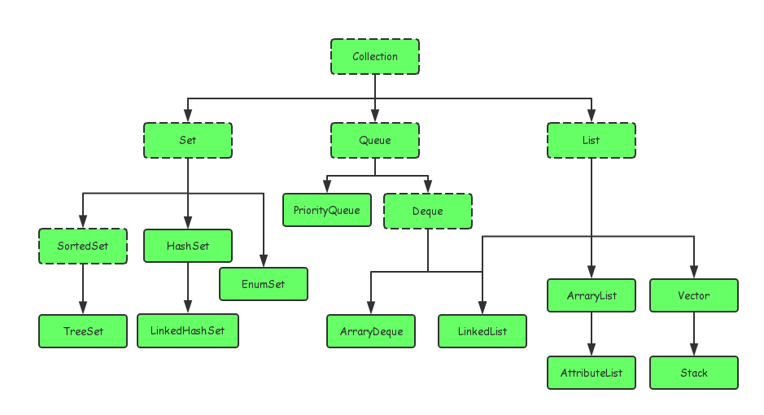
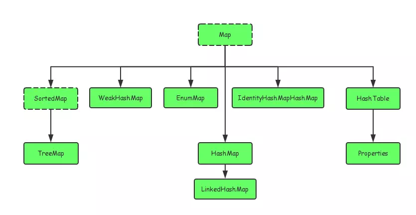

##Java集合和数组的区别
1. 数组长度在初始化时指定，意味着只能保存定长的数据。而集合可以保存数量不确定的数据。同时可以保存具有映射关系的数据（即关联数组，键值对 key-value）。
2. 数组元素即可以是基本类型的值，也可以是对象。集合里只能保存对象（实际上只是保存对象的引用变量），基本数据类型的变量要转换成对应的包装类才能放入集合类中。

##集合框架
Java的集合类主要由两个接口派生而出：Collection和Map,Collection和Map是Java集合框架的根接口。





###使用Iterator遍历集合元素
Iterator接口经常被称作迭代器，它是Collection接口的父接口。但Iterator主要用于遍历集合中的元素。
Iterator接口中主要定义了2个方法：

- hasNext()
- next()

###遍历ArrayList
```aidl
import java.util.*;
 
public class Test{
 public static void main(String[] args) {
     List<String> list=new ArrayList<String>();
     list.add("Hello");
     list.add("World");
     list.add("HAHAHAHA");
     //第一种遍历方法使用foreach遍历List
     for (String str : list) {            //也可以改写for(int i=0;i<list.size();i++)这种形式
        System.out.println(str);
     }
 
     //第二种遍历，把链表变为数组相关的内容进行遍历
     String[] strArray=new String[list.size()];
     list.toArray(strArray);
     for(int i=0;i<strArray.length;i++) //这里也可以改写为  foreach(String str:strArray)这种形式
     {
        System.out.println(strArray[i]);
     }
     
    //第三种遍历 使用迭代器进行相关遍历
     
     Iterator<String> ite=list.iterator();
     while(ite.hasNext())//判断下一个元素之后有值
     {
         System.out.println(ite.next());
     }
 }
}
```
- 第三种方法是采用迭代器的方法，该方法可以不用担心在遍历的过程中会超出集合的长度

- 注意：当使用Iterator对集合元素进行迭代时，Iterator并不是把集合元素本身传给了迭代变量，而是把集合元素的值传给了迭代变量（就如同参数传递是值传递，基本数据类型传递的是值，引用类型传递的仅仅是对象的引用变量），所以修改迭代变量的值对集合元素本身没有任何影响。

###遍历 Map
```aidl
import java.util.*;
 
public class Test{
     public static void main(String[] args) {
      Map<String, String> map = new HashMap<String, String>();
      map.put("1", "value1");
      map.put("2", "value2");
      map.put("3", "value3");
      
      //第一种：普遍使用，二次取值
      System.out.println("通过Map.keySet遍历key和value：");
      for (String key : map.keySet()) {
       System.out.println("key= "+ key + " and value= " + map.get(key));
      }
      
      //第二种
      System.out.println("通过Map.entrySet使用iterator遍历key和value：");
      Iterator<Map.Entry<String, String>> it = map.entrySet().iterator();
      while (it.hasNext()) {
       Map.Entry<String, String> entry = it.next();
       System.out.println("key= " + entry.getKey() + " and value= " + entry.getValue());
      }
      
      //第三种：推荐，尤其是容量大时
      System.out.println("通过Map.entrySet遍历key和value");
      for (Map.Entry<String, String> entry : map.entrySet()) {
       System.out.println("key= " + entry.getKey() + " and value= " + entry.getValue());
      }
    
      //第四种
      System.out.println("通过Map.values()遍历所有的value，但不能遍历key");
      for (String v : map.values()) {
       System.out.println("value= " + v);
      }
     }
}
```


