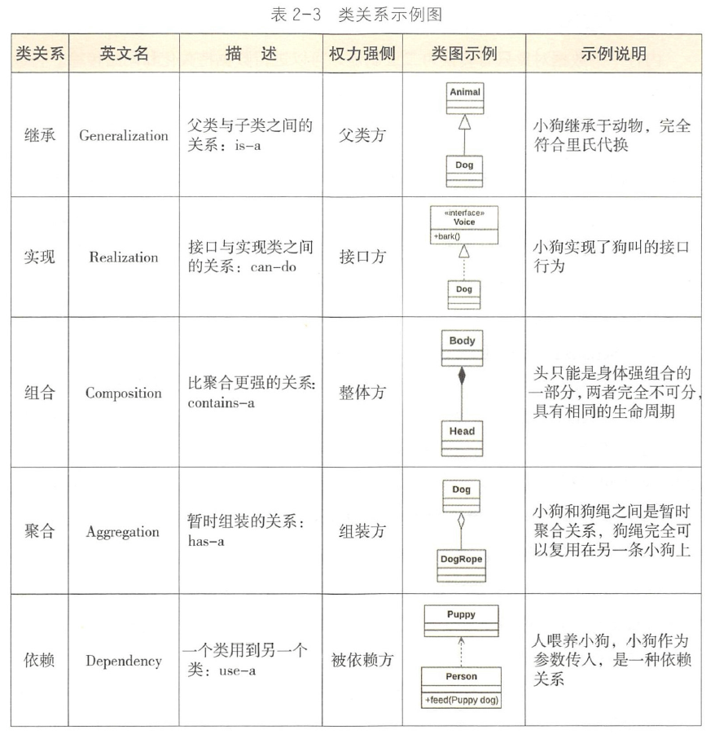

###面向对象的特征
####封装(高内聚、低耦合)
* 封装隐藏了类的内部实现机制，可以在不影响使用的情况下改变类的内部结构，同时也保护
了数据。对外界而已它的内部细节是隐藏的，暴露给外界的只是它的访问方法。
####继承
* 继承是为了重用父类代码。两个类若存在IS-A的关系就可以使用继承
####多态
* 多态就是指程序中定义的引用变量所指向的具体类型和通过该引用变量发出的方法调用
在编程时并不确定，而是在程序运行期间才确定，即一个引用变量倒底会指向哪个类的实例
对象，该引用变量发出的方法调用到底是哪个类中实现的方法，必须在由程序运行期间才能
决定。

- 因为在程序运行时才确定具体的类，这样，不用修改源程序代码，就可以让引用变量
绑定到各种不同的类实现上，从而导致该引用调用的具体方法随之改变，即不修改程序代码
就可以改变程序运行时所绑定的具体代码，让程序可以选择多个运行状态，这就是多态性。

>重载是本类中方法的多态，调用方法时通过传递给方法的不同参数(参数个数、参数类型)来确定具体使用哪个方法。

>重写是父子类方法的多态

###方法的覆写可以总结成容易记忆的口诀 “ 一大两小两同”
- 一大：子类的方法访问权限控制符只能相同或变大。

- 两小：抛出异常和返回值只能变小， 能够转型成父类对象。子类的返回值、
    抛出异常类型必须与父类的返回值、抛出异常类型存在继承关系。

- 两同：方法名和参数必须完全相同。

###Java实现多态有三个必要条件：继承、重写、向上转型。

1. 继承：在多态中必须存在有继承关系的子类和父类。
2. 重写：子类对父类中某些方法进行重新定义，在调用这些方法时就会调用子类的方法。
3. 向上转型：在多态中需要将子类的引用赋给父类对象，只有这样该引用才能够具备技能调用父类的方法和子类的方法。

```aidl
Person为父类，Student为子类。那么：
Person p = new Student()；
```

* 只有满足了上述三个条件，我们才能够在同一个继承结构中使用统一的逻辑实现代码处理不同的对象，从而达到执行不同的行为。

- 基于继承实现的多态
    - 对于引用子类的父类类型，在处理该引用时，它适用于继承该父类的所有子类，子类对象的不同，对方法的实现也就不同，执行相同动作产生的行为也就不同。
    
- 接口的多态中
    - 指向接口的引用必须是指定这实现了该接口的一个类的实例程序，在运行时，根据对象引用的实际类型来执行对应的方法。
   
###Java中多态的实现方式：
- 接口实现
- 继承父类进行方法重写
- 同一个类中进行方法重载。
    
###面向对象的好处
- 1、易维护
    - 采用面向对象思想设计的结构，可读性高，由于继承的存在，即使改变需求，那么维护也只是在局部模块，所以维护起来是非常方便和较低成本的。

- 2、易复用
    - 在设计时，可重用现有的，在以前的项目的领域中已被测试过的类使系统满足业务需求并具有较高的质量。

- 3、效率高
    - 在软件开发时，根据设计的需要对现实世界的事物进行抽象，产生类。使用这样的方法解决问题，接近于日常生活和自然的思考方式，势必提高软件开发的效率和质量。

- 4、易扩展
    - 由于继承、封装、多态的特性，自然设计出高内聚、低耦合的系统结构，使得系统更灵活、更容易扩展，而且成本较低。
    
    
###public
- public：可以被所有其他类所访问

- protected：自身、子类及同一个包中类可以访问

- default：同一包中的类可以访问，声明时没有加修饰符，认为是friendly。

- private：只能被自己访问和修改

###类关系
- ［ 继承］ extends (is-a)
- ［ 实现］ implements (can - do)
- ［ 组合］ 类是成员变量（contains-a） 
- ｛ 聚合｝ 类是成员变量（has-a） 
- ［ 依赖］ import 类（use-a） 

