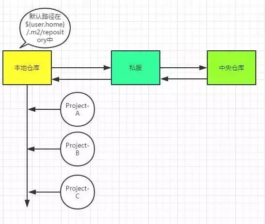

####Maven
* > 生命周期（三套独立的生命周期）
    * Clean Lifecycle 在进行真正的构建之前进行一些清理工作
    * Default Lifecycle 构建的核心部分，编译、测试、打包和部署
    * Site Lifecycle 生成项目报告、生成站点和发布站点

* > 默认（Default）的生命周期
    * 验证（validate） 验证项目是否正确，所有必要的信息可用
    * 编译（compile） 编译项目的源代码
    * 测试（test） 使用合适的单元测试框架测试编译的源代码
    * 打包（package） 采用编译的代码，并以其可分配格式进行打包
    * 校验（verify） 对集成测试的结果执行任何检查，以确保满足质量标准
    * 安装（install） 将软件包安装到本地存储库中，用作本地其他项目的依赖项
    * 部署（deploy） 在构建环境中完成，将最终的复制到远程存储库中以与其他开发人员进行项目共享
    
###一个基于Java的工具

###使用流程
- 回想一下，当你新到一家公司，安装完JDK后就会安装配置Maven（MAVEN_HOME、path），很大可能性你需要修改settings.xml文件，比如你会修改本地仓库地址路径，比如你很可能会copy一段配置到你的settings.xml中（很可能就是私服的一些配置）。

- 私服中存储了本公司的内部专用的jar

- 接下来，你会到IDEA或者Eclipse中进行Maven插件配置，然后你就可以在工程中的pom.xml里面开始添加<dependency>标签来管理jar包，在Maven规范的目录结构下进行编写代码，最后你会通过插件的方式来进行测试、打包（jar or war）、部署、运行。

###Maven仓库

###中央仓库：
- 该仓库存储了互联网上的jar，由Maven团队来维护，地址是：http://repo1.maven.org/maven2/。

###依赖管理

###常用命令
clean：有问题，多清理！

package：打成Jar or War包，会自动进行clean+compile

install：将本地工程Jar上传到本地仓库

deploy：上传到私服

###maven classpath
 
   - 编译classpath：编译项目代码，依赖的jar会被引入到classpath
   - 测试classpath：编译和执行测试部分代码，如单元测试，集成测试，依赖会被引入到classpath
   - 运行classpath：实际运行代码的时候，依赖的jar会被引入到classpath
   
###关于scope依赖范围
- compile：默认的scope，对编译classpath、测试classpath、运行classpath都有效，在三个阶段都需要指定的jar

- provided：编译和测试可用，不会被传递依赖，不会被打包。例：依赖于web容器中的提供的一个jar包，在编译的时候需要加入依赖（web容器还没有介入），运行的时候由web容器来提供。如servlet-api。

- runtime：运行和测试时需要，但编译时不需要。最典型的例子是JDBC的驱动，编译时只需要提供驱动的API即可，在运行和测试阶段，需要加载到具体的驱动实现。

- test：执行单元测试时可用，不会被打包，不会被传递依赖

- system：非本地仓库引入、存在系统的某个路径下的jar。（一般不使用）

###maven依赖原则
- 1、依赖路径最短优先原则

    一个项目Demo依赖了两个jar包，其中A-B-C-X(1.0) ， A-D-X(2.0)。由于X(2.0)路径最短，所以项目使用的是X(2.0)。

- 2、pom文件中申明顺序优先

    如果A-B-X(1.0) ，A-C-X(2.0) 这样的路径长度一样怎么办呢？这样的情况下，maven会根据pom文件声明的顺序加载，如果先声明了B，后声明了C，那就最后的依赖就会是X(1.0)。
    
- 3、覆写优先
  
  子pom内声明的优先于父pom中的依赖。
  
###如何解决jar冲突
###[参考](http://www.cnblogs.com/davenkin/p/advanced-maven-resolve-dependencies-conflicts.html) 
   - 遇到冲突的时候第一步要找到maven加载的到时是什么版本的jar包，通过们mvn dependency:tree查看依赖树，通过maven的依赖原则来调整坐标在pom文件的申明顺序是最好的办法。
   
   - 如要解决冲突问题，很多时候都用到exclusions,如A->B->D（v1）,A->C-D（v2）,要指定A->D(v1),则需要在声明C的依赖时候通过exclusions列表排除掉对D(v2)的依赖。
   
   - 方法1：显式加入对project-common 2.0版本的依赖
   - 方法2：resolve-web对project-A的dependency声明中，将project-common排除掉。
   