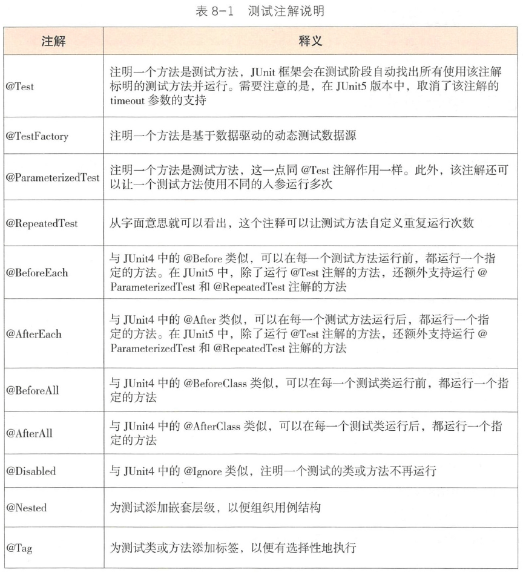

###单元测试要符合AIR 原则
- A : Automatic（自动化）
- I : Independent（独立性）
- R : Repeatable（可重复）

###单元测试中不允许使用System.out 来进行人工验证，而必须使用断言来验证。

###编写单元测试用例时，为了保证被测模块的交付质量，需要符合BCDE 原则。

- B: Border ， 边界值测试，包括循环边界、特殊取值、特殊时间点、数据顺序等。
- C: Correct ， 正确的输入， 并得到预期的结果。
- D: Design ， 与设计文档相结合，来编写单元测试。
- E : Error ， 单元测试的目标是证明程序有错，而不是程序无错。为了发现代
码中潜在的错误， 我们需要在编写测试用例时有一些强制的错误输入（如非
法数据、异常流程、非业务允许输入等）来得到预期的错误结果。

##单元测试编写
###JUnit 单元测试框架

