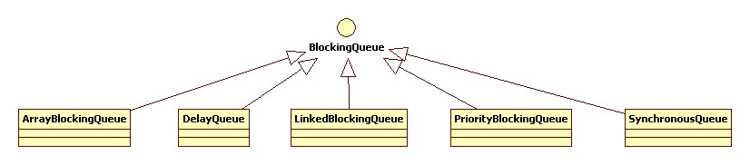

###阻塞队列
- 生产者消费者：两个常见阻塞场景：
    - 队列没有数据，消费者线程挂起（阻塞）
    - 队列数据满了，生产者线程阻塞     
这也是我们在多线程环境下，为什么需要BlockingQueue的原因。作为BlockingQueue的使用者，我们再也不需要关心什么时候需要阻塞线程，什么时候需要唤醒线程，因为这一切BlockingQueue都给你一手包办了

###BlockingQueue具体实现

- ArrayBlockingQueue
    - 基于数组的阻塞队列实现，在ArrayBlockingQueue内部，维护了一个定长数组，以便缓存队列中的数据对象，这是一个常用的阻塞队列，除了一个定长数组外，ArrayBlockingQueue内部还保存着两个整形变量，分别标识着队列的头部和尾部在数组中的位置。
  　ArrayBlockingQueue在生产者放入数据和消费者获取数据，都是共用同一个锁对象，由此也意味着两者无法真正并行运行，这点尤其不同于LinkedBlockingQueue；按照实现原理来分析，ArrayBlockingQueue完全可以采用分离锁，从而实现生产者和消费者操作的完全并行运行。
  
- LinkedBlockingQueue
    - 基于链表的阻塞队列，同ArrayListBlockingQueue类似，其内部也维持着一个数据缓冲队列（该队列由一个链表构成），当生产者往队列中放入一个数据时，队列会从生产者手中获取数据，并缓存在队列内部，而生产者立即返回；只有当队列缓冲区达到最大值缓存容量时（LinkedBlockingQueue可以通过构造函数指定该值），才会阻塞生产者队列，直到消费者从队列中消费掉一份数据，生产者线程会被唤醒，反之对于消费者这端的处理也基于同样的原理。而LinkedBlockingQueue之所以能够高效的处理并发数据，还因为其对于生产者端和消费者端分别采用了独立的锁来控制数据同步，这也意味着在高并发的情况下生产者和消费者可以并行地操作队列中的数据，以此来提高整个队列的并发性能。
    
- DelayQueue
    - DelayQueue中的元素只有当其指定的延迟时间到了，才能够从队列中获取到该元素。DelayQueue是一个没有大小限制的队列，因此往队列中插入数据的操作（生产者）永远不会被阻塞，而只有获取数据的操作（消费者）才会被阻塞。
    - 使用场景：DelayQueue使用场景较少，但都相当巧妙，常见的例子比如使用一个DelayQueue来管理一个超时未响应的连接队列。
    
- PriorityBlockingQueue
    - 基于优先级的阻塞队列（优先级的判断通过构造函数传入的Compator对象来决定），但需要注意的是PriorityBlockingQueue并不会阻塞数据生产者，而只会在没有可消费的数据时，阻塞数据的消费者。因此使用的时候要特别注意，生产者生产数据的速度绝对不能快于消费者消费数据的速度，否则时间一长，会最终耗尽所有的可用堆内存空间。在实现PriorityBlockingQueue时，内部控制线程同步的锁采用的是公平锁。
    
- SynchronousQueue
    -  一种无缓冲的等待队列，类似于无中介的直接交易，有点像原始社会中的生产者和消费者，生产者拿着产品去集市销售给产品的最终消费者，而消费者必须亲自去集市找到所要商品的直接生产者，如果一方没有找到合适的目标，那么对不起，大家都在集市等待。