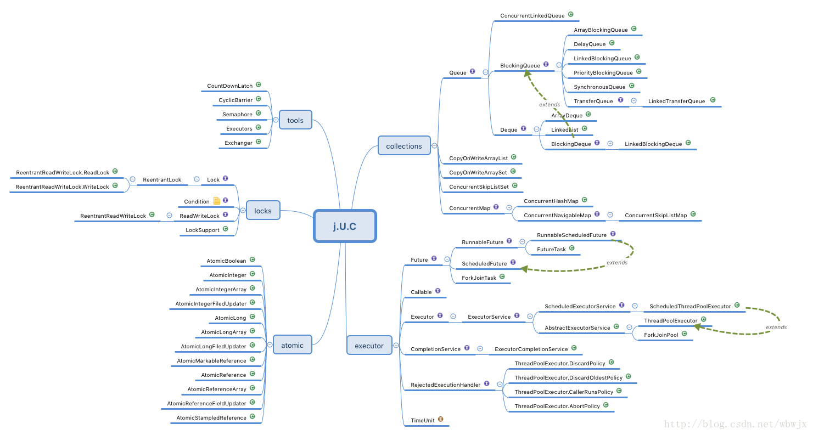
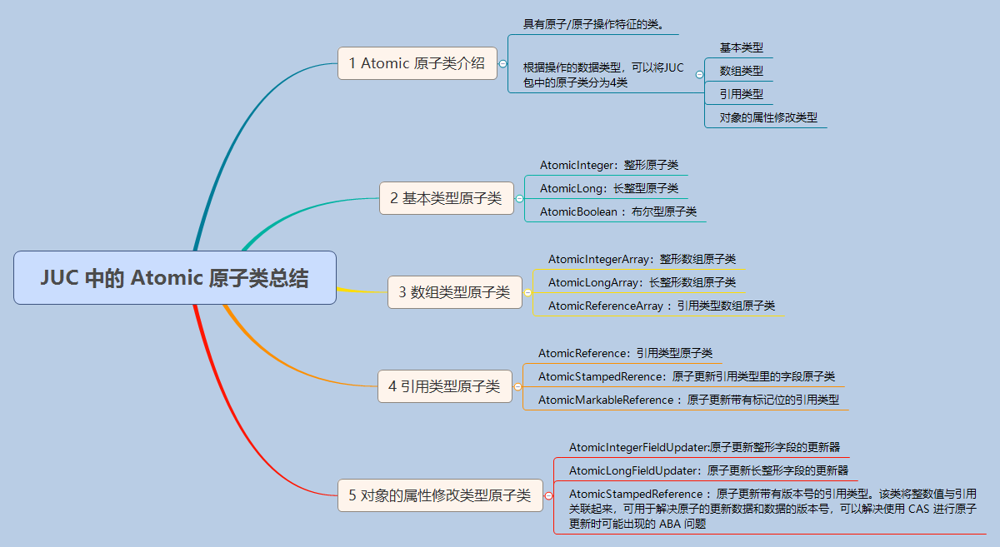

###创建并发包的目的
- 要实现 Collection 框架对数据结构所执行的并发操作
- 通过提供一组可靠的、高性能并发构建块，开发人员可以提高并发类的线程安全、可伸缩性、性能、可读性和可靠性。

###结构



- locks部分：显式锁(互斥锁和速写锁)相关；
- atomic部分：原子变量类相关，是构建非阻塞算法的基础；
- executor部分：线程池相关；
- collections部分：并发容器相关；
- tools部分：同步工具相关，如信号量、闭锁、栅栏等功能；

###locks部分

####lock

####简述synchronized和java.util.concurrent.locks.Lock的异同 ？
- 主要相同点：Lock能完成synchronized所实现的所有功能
- 主要不同点：
    - Lock有比synchronized更精确的线程语义和更好的性能。
    - synchronized会自动释放锁，而Lock一定要求程序员手工释放，
    并且必须在finally从句中释放，否则容易造成线程死锁
    - Lock还有更强大的功能，例如，它的tryLock方法可以非阻塞方式去拿锁。

####ReentrantLock
- ReentrantLock是可重入锁。如果锁具备可重入性，则称为可重入锁，
- synchronized和ReentrantLock都是可重入锁。
- 可重入锁也叫递归锁，当一个线程已经获得该代码块的锁时，再次进入该代码块不必重新申请锁，可以直接执行。

####ReadWriteLock
- readLock()用来获取读锁，
- writeLock()用来获取写锁。
- 也就是将文件的读写操作分开，分成两个锁来分配给线程，
- 从而使多个线程可以同时进行读操作。
- ReentrantReadWriteLock是它的实现类。

  
###atomic部分
- 原子类说简单点就是具有原子/原子操作特征的类。



####基本数据类型原子类的优势
- 不使用原子类
```$xslt
class Test {
        private volatile int count = 0;
        //若要线程安全执行执行count++，需要加锁
        public synchronized void increment() {
                  count++; 
        }

        public int getCount() {
                  return count;
        }
}
```
- 使用原子类
```$xslt
class Test2 {
        private AtomicInteger count = new AtomicInteger();

        public void increment() {
                  count.incrementAndGet();
        }
        //使用AtomicInteger之后，不需要加锁，也可以实现线程安全。
        public int getCount() {
                return count.get();
        }
}
```

- AtomicInteger 线程安全原理简单分析
```$xslt
// setup to use Unsafe.compareAndSwapInt for updates（更新操作时提供“比较并替换”的作用）
    private static final Unsafe unsafe = Unsafe.getUnsafe();
    private static final long valueOffset;

    static {
        try {
            valueOffset = unsafe.objectFieldOffset
                (AtomicInteger.class.getDeclaredField("value"));
        } catch (Exception ex) { throw new Error(ex); }
    }

    private volatile int value;
```

- AtomicInteger 类主要利用 CAS (compare and swap) + volatile 和 
native 方法来保证原子操作，从而避免 synchronized 的高开销，执行效率大为提升。
- CAS的原理是拿期望的值和原本的一个值作比较，如果相同则更新成新的值。
- UnSafe类的objectFieldOffset()方法是一个本地方法，
这个方法是用来拿到“原来的值”的内存地址，返回值是valueOffset。
另外 value 是一个volatile变量，在内存中可见，
因此 JVM 可以保证任何时刻任何线程总能拿到该变量的最新值。

####什么是CAS?
  - 使用锁时，线程获取锁是一种悲观锁策略，即假设每一次执行临界区代码都会产生冲突，
  所以当前线程获取到锁的时候同时也会阻塞其他线程获取该锁。
  - 而CAS操作（又称为无锁操作）是一种乐观锁策略，它假设所有线程访问共享资源的时候不会出现冲突，
  既然不会出现冲突自然而然就不会阻塞其他线程的操作。因此，线程就不会出现阻塞停顿的状态。
  - 那么，如果出现冲突了怎么办？无锁操作是使用CAS(compare and swap)又叫做比较交换来鉴别线程是否出现冲突，
  出现冲突就重试当前操作直到没有冲突为止。
  
####CAS的操作过程
- CAS比较交换的过程可以通俗的理解为CAS(V,O,N)，包含三个值分别为：
V 内存地址存放的实际值；O 预期的值（旧值）；N 更新的新值。

- 当V和O相同时，也就是说旧值和内存中实际的值相同表明该值没有被其他线程更改过，
即该旧值O就是目前来说最新的值了，自然而然可以将新值N赋值给V。

- 反之，V和O不相同，表明该值已经被其他线程改过了则该旧值O不是最新版本的值了，
所以不能将新值N赋给V，返回V即可。

- 当多个线程使用CAS操作一个变量是，只有一个线程会成功，并成功更新，其余会失败。
失败的线程会重新尝试，当然也可以选择挂起线程

- CAS的实现需要硬件指令集的支撑，在JDK1.5后虚拟机才可以使用处理器提供的CMPXCHG指令实现。

####CAS的问题
- ABA问题

因为CAS会检查旧值有没有变化，这里存在这样一个有意思的问题。
比如一个旧值A变为了成B，然后再变成A，刚好在做CAS时检查发现旧值并没有变化依然为A，
但是实际上的确发生了变化。解决方案可以沿袭数据库中常用的乐观锁方式，
添加一个版本号可以解决。原来的变化路径A->B->A就变成了1A->2B->3C。

- 自旋时间过长

使用CAS时非阻塞同步，也就是说不会将线程挂起，
会自旋（无非就是一个死循环）进行下一次尝试，
如果这里自旋时间过长对性能是很大的消耗。
如果JVM能支持处理器提供的pause指令，那么在效率上会有一定的提升。

###executor部分

- 

###collections部分

- BlockingQueue

- ConcurrentMap
    - 实现类ConcurrentHashMap
    - ConcurrentHashMap 能够提供比 HashTable 更好的并发性能


###tools部分

[参考](https://www.cnblogs.com/gxyandwmm/p/9398934.html)
- CountDownLatch用法
    - 使用CountDownLatch时,几个线程使用同一个CountDownLatch对象 有一个线程调用wait方法  其他线程使用countDown()方法，当最后计数器减到0的时候，wait调用处继续往下执行；

- CyclicBarrier用法 
    - 使用CyclicBrarrier，几个线程在执行到需要进行栅栏的地方时 调用 CyclicBrarrier 对象的 wait 方法，然后当所有的对象都执行到栅栏的地方后，统一进行放行，往后执行
    - 叫做回环是因为当所有等待线程都被释放以后，CyclicBarrier可以被重用

- Semaphore用法
    - 信号量，Semaphore可以控制同时访问的线程个数，通过 acquire() 获取一个许可，如果没有就等待，而 release() 释放一个许可。
    
- exchanger用法
    - Exchanger是在两个任务之间交换对象的栅栏（交换点），当这些任务进入栅栏时，它们各自拥有一个对象。然后将已知的对象传给对方，返回接收的对象
    - 它典型的应用场景是：一个任务在创建对象，这些对象的生产代价很高昂，而另一个任务在消费这些对象。通过这种方式，可以有更多的对象在被创建的同时被消费。