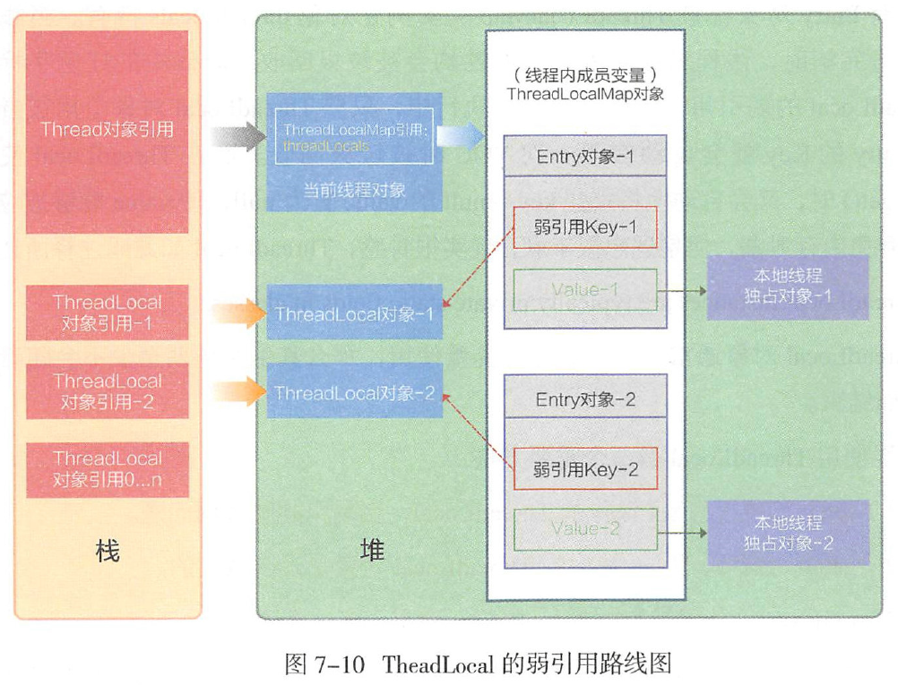

###ThreadLocal类
- 这个类（ThreadLocal）提供了线程局部变量。线程局部变量与普通变量的不同之处在于线程局部变量是每一个线程都维护了一份副本的，相互独立并且可以通过get/set方法访问

- ThreadLocal可以为使用相同变量的每个不同的线程都创建不同的存储，这样就可以避免多线程在共享资源的使用上产生冲突

- 英语恰当的名称应该叫作 CopyValuelntoEveryThread

###ThreadLocal与同步机制的比较：
- ThreadLocal和线程同步机制都是为了解决多线程中相同变量的访问冲突问题。

- 在同步机制中，通过对象的锁机制保证同一时间只有一个线程访问变量。这时该变量是多个线程共享的，使用同步机制要求程序慎密地分析什么时候对变量进行读写，什么时候需要锁定某个对象，什么时候释放对象锁等繁杂的问题，程序设计和编写难度相对较大。

- 而ThreadLocal则从另一个角度来解决多线程的并发访问。ThreadLocal会为每一个线程提供一个独立的变量副本，从而隔离了多个线程对数据的访问冲突。因为每一个线程都拥有自己的变量副本，从而也就没有必要对该变量进行同步了。ThreadLocal提供了线程安全的共享对象，在编写多线程代码时，可以把不安全的变量封装进ThreadLocal。

- 概括起来说，对于多线程资源共享的问题，同步机制采用了“以时间换空间”的方式，而ThreadLocal采用了“以空间换时间”的方式。前者仅提供一份变量，让不同的线程排队访问，而后者为每一个线程都提供了一份变量，因此可以同时访问而互不影响。

- Synchronized用于线程间的数据共享，而ThreadLocal则用于线程间的数据隔离。

###使用方法
1. 初始化一个ThreadLocal类静态成员，根据需求override其初始化方法initialValue，设置初始值。
2. 使用set方法设置当前线程的ThreadLocal新值。

3. 使用get获得当前线程的该ThreadLocal的值。

###类图


###基本原理
在ThreadLocal类中定义了一个ThreadLocalMap，每一个Thread都有一个ThreadLocalMap类型的变量threadLocals，就是用threadLocals来存储每一个线程的变量副本，threadLocals内部有一个Entry数组，我们根据键值线程对象，来找到对应线程的变量副本。



- 1 个 Thread 有且仅有1个 ThreadLocalMap 对象，
- 1 个 Entry 对象的Key弱引用指向1个 ThreadLocal 对象；
- 1 个 ThreadLocalMap 对象存储多个 Entry 对象，
- 1 个 ThreadLocal 对象可以被多个线程所共享
- ThreadLocal 对象不持有 Value, Value 由线程的 Entry 对象持有。

[基本原理](https://www.cnblogs.com/xujian2014/p/5777849.html)

###使用场景
- 最常见的ThreadLocal使用场景为 用来解决 数据库连接、Session管理等。
- 无法解决共享对象的更新问题

###ThreadLocal 副作用
- 脏数据
    - 线程复用会产生脏数据。由于结程池会重用Thread 对象，那么与Thread 绑定的
      类的静态属性ThreadLocal 变量也会被重用。如果在实现的线程run（）方法体中不显
      式地调用remove（） 清理与线程相关的ThreadLocal 信息，那么倘若下一个线程不调用
      set（）设置初始值，就可能get（）到重用的线程信息，包括ThreadLocal 所关联的线程对
      象的value 值。
      
- 内存泄漏
    - 在源码注释中提示使用static 关键字来修饰ThreadLocal。在此场景下，寄希望于
      ThreadLocal 对象失去引用后， 触发弱引用机制来回收Entry 的Value 就不现实了。在
      上例中，如果不进行remove（）操作， 那么这个线程执行完成后，通过ThreadLocal 对象持有的String 对象是不会被释放的。

###解决方案
- ThreadLocal在线程使用完毕后，要手动调用remove方法，移除他内部的值，防止内存泄露。

###非线程安全代码：

```aidl
public class TestDao {  
    private Connection conn;// ①一个非线程安全的变量  
  
    public void addTopic() throws SQLException {  
        Statement stat = conn.createStatement();// ②引用非线程安全变量  
        // …  
    }  
}
```

###线程安全代码

```aidl
public class TestDaoNew {  
    // ①使用ThreadLocal保存Connection变量  
    private static ThreadLocal<Connection> connThreadLocal = new ThreadLocal<Connection>();  
  
    public static Connection getConnection() {  
        // ②如果connThreadLocal没有本线程对应的Connection创建一个新的Connection，  
        // 并将其保存到线程本地变量中。  
        if (connThreadLocal.get() == null) {  
            Connection conn = getConnection();  
            connThreadLocal.set(conn);  
            return conn;  
        } else {  
            return connThreadLocal.get();// ③直接返回线程本地变量  
        }  
    }  
  
    public void addTopic() throws SQLException {  
        // ④从ThreadLocal中获取线程对应的Connection  
        Statement stat = getConnection().createStatement();  
    }  
}
```

- 不同的线程在使用TopicDao时，先判断connThreadLocal.get()是否是null，如果是null，则说明当前线程还没有对应的Connection对象，这时创建一个Connection对象并添加到本地线程变量中；如果不为null，则说明当前的线程已经拥有了Connection对象，直接使用就可以了。这样，就保证了不同的线程使用线程相关的Connection，而不会使用其它线程的Connection。因此，这个TopicDao就可以做到singleton共享了。

- 当然，这个例子本身很粗糙，将Connection的ThreadLocal直接放在DAO只能做到本DAO的多个方法共享Connection时不发生线程安全问题，但无法和其它DAO共用同一个Connection，要做到同一事务多DAO共享同一Connection，必须在一个共同的外部类使用ThreadLocal保存Connection。

```aidl
public class ConnectionManager {  
  
    private static ThreadLocal<Connection> connectionHolder = new ThreadLocal<Connection>() {  
        @Override  
        protected Connection initialValue() {  
            Connection conn = null;  
            try {  
                conn = DriverManager.getConnection(  
                        "jdbc:mysql://localhost:3306/test", "username",  
                        "password");  
            } catch (SQLException e) {  
                e.printStackTrace();  
            }  
            return conn;  
        }  
    };  
  
    public static Connection getConnection() {  
        return connectionHolder.get();  
    }  
  
    public static void setConnection(Connection conn) {  
        connectionHolder.set(conn);  
    }  
}
```

