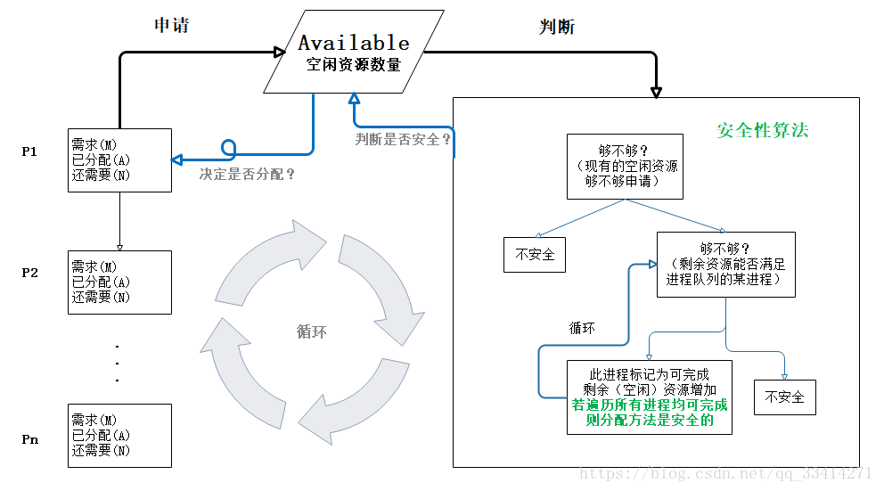

###线程有几种状态？
- NEW （新建状态）
    - 即新建状态，是线和被创建旦未启动的状态。
- RUNNABLE （就绪状态）
    - 即就绪状态， 是调用start（） 之后运行之前的状态。
- RUNNING （运行状态）
    - 即运行状态， 是run （） 正在执行时线程的状态。线程可能会由于某些因素而退出RUNNING ，如时间、异常、锁、调度等。
    
- BLOCKED （阻塞状态）
    - 即阻塞状态， 进入此状态， 有以下种情况:
        - 同步阻塞:锁被其他线程占用。
        - 主动阻塞:调用Thread 的某些方法，主动让出CPU 执行权，比如sleep（） 、join（） 等。
        - 等待阻塞:执行了wait（）。
- DEAD （终止状态）
    - 即终止状态，是run （） 执行结束，或同异常退出后的状态， 此状态不可逆转。
       

###线程同步的方式
- 互斥量 Synchronized/Lock：采用互斥对象机制，只有拥有互斥对象的线程才有访问公共资源的权限。因为互斥对象只有一个，所以可以保证公共资源不会被多个线程同时访问

- 信号量 Semphare：它允许同一时刻多个线程访问同一资源，但是需要控制同一时刻访问此资源的最大线程数量

- 事件(信号)，Wait/Notify：通过通知操作的方式来保持多线程同步，还可以方便的实现多线程优先级的比较操作

###sleep和wait方法有什么区别
- 从使用角度看，sleep是Thread线程类的方法，而wait是Object顶级类的方法。
  sleep可以在任何地方使用，而wait只能在同步方法或者同步块中使用

- sleep,wait调用后都会暂停当前线程并让出cpu的执行时间，但不同的是sleep不会释放当前持有的对象的锁资源，到时间后会继续执行，而wait会放弃所有锁并需要notify/notifyAll后重新获取到对象锁资源后才能继续执行
 
###join()
- join()方法使调用该方法的线程在此之前执行完毕，也就是等待该方法的线程执行完毕后再往下继续执行。注意该方法也需要捕捉异常。
 
###yield()
- 该方法与sleep()类似，也不会释放锁，不能由用户指定暂停多长时间，并且yield（）方法只能让同优先级的线程有执行的机会。

###什么是死锁？死锁产生的条件？
####死锁的概念
- 两个或多个进程无限期的阻塞、相互等待对方占有资源释放的一种状态。
####死锁产生的四个必要条件
- 互斥：至少有一个资源必须属于非共享模式，即一次只能被一个进程使用；若其他申请使用该资源，那么申请进程必须等到该资源被释放为止；

- 占有并等待：一个进程必须占有至少一个资源，并等待另一个资源，而该资源为其他进程所占有；

- 非抢占：进程不能被抢占，即资源只能被进程在完成任务后自愿释放

- 循环等待：若干进程之间形成一种头尾相接的环形等待资源关系
####死锁的处理基本策略和常用方法
死锁预防的基本思想是 只要确保死锁发生的四个必要条件中至少有一个不成立，就能预防死锁的发生，具体方法包括：

- 打破互斥条件：允许进程同时访问某些资源。但是，有些资源是不能被多个进程所共享的，这是由资源本身属性所决定的，因此，这种办法通常并无实用价值。

- 打破占有并等待条件：可以实行资源预先分配策略(进程在运行前一次性向系统申请它所需要的全部资源，若所需全部资源得不到满足，则不分配任何资源，此进程暂不运行；只有当系统能满足当前进程所需的全部资源时，才一次性将所申请资源全部分配给该线程)或者只允许进程在没有占用资源时才可以申请资源（一个进程可申请一些资源并使用它们，但是在当前进程申请更多资源之前，它必须全部释放当前所占有的资源）。但是这种策略也存在一些缺点：在很多情况下，无法预知一个进程执行前所需的全部资源，因为进程是动态执行的，不可预知的；同时，会降低资源利用率，导致降低了进程的并发性。

- 打破非抢占条件：允许进程强行从占有者哪里夺取某些资源。也就是说，但一个进程占有了一部分资源，在其申请新的资源且得不到满足时，它必须释放所有占有的资源以便让其它线程使用。这种预防死锁的方式实现起来困难，会降低系统性能。

- 打破循环等待条件：实行资源有序分配策略。对所有资源排序编号，所有进程对资源的请求必须严格按资源序号递增的顺序提出，即只有占用了小号资源才能申请大号资源，这样就不回产生环路，预防死锁的发生。

####死锁避免的基本思想 
死锁避免的基本思想是动态地检测资源分配状态，以确保循环等待条件不成立，从而确保系统处于安全状态。

所谓安全状态是指：如果系统能按某个顺序为每个进程分配资源（不超过其最大值），那么系统状态是安全的，

换句话说就是，如果存在一个安全序列，那么系统处于安全状态。

资源分配图算法和银行家算法是两种经典的死锁避免的算法，其可以确保系统始终处于安全状态。

其中，资源分配图算法应用场景为每种资源类型只有一个实例(申请边，分配边，需求边，不形成环才允许分配)，

而银行家算法应用于每种资源类型可以有多个实例的场景
- 当一个进程申请使用资源的时候，银行家算法通过先 试探 分配给该进程资源，然后通过安全性算法判断分配后的系统是否处于安全状态，若不安全则试探分配作废，让该进程继续等待。

####死锁解除
死锁解除的常用两种方法为进程终止和资源抢占。
- 进程终止是指简单地终止一个或多个进程以打破循环等待，包括两种方式：
    - 终止所有死锁进程
    - 一次只终止一个进程直到取消死锁循环为止；
- 资源抢占是指从一个或多个死锁进程那里抢占一个或多个资源

