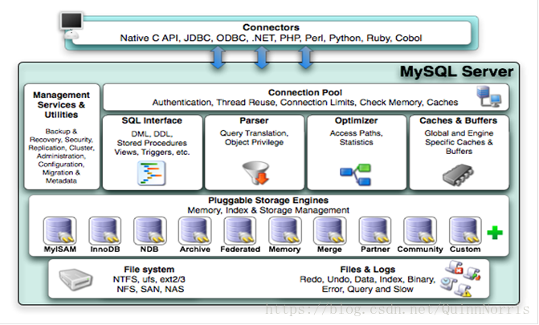

###MySQL架构
1. 连接池：
    - 最上层负责和客户端进行连接，比如jdbc，odbj这样的数据库连接的API，在这一层有连接池的概念，类似于线程池，连接池可以同时处理很多个数据库请求。同时这一层有SSL的安全概念，可以确保连接是安全的。
2. SQL接口：
    - 当SQL语句进入MySQL后，会先到SQL接口中，这一层是封装层，将传过来的SQL语句拆散，将底层的结果封装成SQL的数据格式。
3. 解析器：
    - 这一层负责将SQL语句进行拆分，验证，如果语句有问题那么就返回错误，如果没问题就继续向下执行。
4. 优化器：
    - 对SQL查询的结果优化处理，产生多种执行计划，最终数据库会选择最优化的方案去执行，尽快返会结果。比如select a，b from c where d。在这里会先查询c表中符合d的数据并将他们的ab项进行投影，返回结果，并不会直接把整张表查出来。
5. 缓存：
    - 对要查询的SQL语句进行hash后缓存，如果下一次是相同的查询语句，则在SQL接口之后直接返回结果。
6. 存储引擎：
    - MySQL有很多种存储引擎，每一种存储引擎有不同的特性，他们负责组织文件的存放形式，位置，访问文件的方法等等。比较常用的有innoDB，MyISAM，MAMORY等。
7. 文件系统：
    - 存放数据的文件。
    
