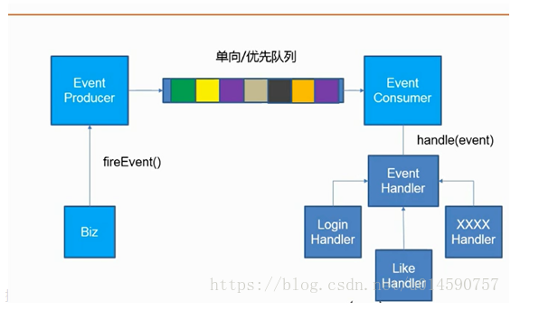

###Redis最适合的场景？
（1）、会话缓存（Session Cache） 

 最常用的一种使用Redis的情景是会话缓存（session cache）。用Redis缓存会话比其他存储（如Memcached）的优势在于：Redis提供持久化。当维护一个不是严格要求一致性的缓存时，如果用户的购物车信息全部丢失，大部分人都会不高兴的，现在，他们还会这样吗？ 幸运的是，随着 Redis 这些年的改进，很容易找到怎么恰当的使用Redis来缓存会话的文档。甚至广为人知的商业平台Magento也提供Redis的插件。

（2）、全页缓存（FPC）

 除基本的会话token之外，Redis还提供很简便的FPC平台。回到一致性问题，即使重启了Redis实例，因为有磁盘的持久化，用户也不会看到页面加载速度的下降，这是一个极大改进，类似PHP本地FPC。 再次以Magento为例，Magento提供一个插件来使用Redis作为全页缓存后端。 此外，对WordPress的用户来说，Pantheon有一个非常好的插件 wp-redis，这个插件能帮助你以最快速度加载你曾浏览过的页面。

（3）、队列 

 Reids在内存存储引擎领域的一大优点是提供 list 和 set 操作，这使得Redis能作为一个很好的消息队列平台来使用。Redis作为队列使用的操作，就类似于本地程序语言（如Python）对 list 的 push/pop 操作。 如果你快速的在Google中搜索“Redis queues”，你马上就能找到大量的开源项目，这些项目的目的就是利用Redis创建非常好的后端工具，以满足各种队列需求。例如，Celery有一个后台就是使用Redis作为broker，你可以从这里去查看。

（4）、排行榜/计数器 

 Redis在内存中对数字进行递增或递减的操作实现的非常好。集合（Set）和有序集合（Sorted Set）也使得我们在执行这些操作的时候变的非常简单，Redis只是正好提供了这两种数据结构。所以，我们要从排序集合中获取到排名最靠前的10个用户–我们称之为“user_scores”，我们只需要像下面一样执行即可： 当然，这是假定你是根据你用户的分数做递增的排序。如果你想返回用户及用户的分数，你需要这样执行： ZRANGE user_scores 0 10 WITHSCORES Agora Games就是一个很好的例子，用Ruby实现的，它的排行榜就是使用Redis来存储数据的，你可以在这里看到。

（5）、发布/订阅 

 最后（但肯定不是最不重要的）是Redis的发布/订阅功能。发布/订阅的使用场景确实非常多。我已看见人们在社交网络连接中使用，还可作为基于发布/订阅的脚本触发器，甚至用Redis的发布/订阅功能来建立聊天系统！

###基于redis实现异步消息队列

EventProducer将事件推送到消息队列中，EventConsumer监听队列，只要监测到有事件到达，就将事件取出，交给对应的Handler进行处理



1. 使用redis的列表作为队列，lpush、rpop
2. EventProducer：生产者,负责把事件模型添加到队列中。如点赞操作时，在点赞操作接口生成生产者类，在点赞操作时，调用类中fireEvent（EventModel model）方法将点赞事件添加到Redis队列中。
3. EventModel：事件模型，里面包含事件的类型和事件对应的数据，序列化存储在队列中
4. EventType：事件类型，Enum，点赞、评论、邮件、登陆分别对应不同的枚举值
5. EventHandler：接口，提供handler()、getSupportedTypes()两个方法。
6. LikeHandler：继承EventHandler接口，提供处理方法和支持多种类型的事件
7. EventConsumer：消费者，设计是一个事件模型传过来，获取它的事件类型。

- 先将所有的Handler注册了，在消费者类初始化时找出所有Handler。

```
Map<String,EventHandler> beans = applicationContext.getBeansOfType(EventHandler.class)
```

- 设置一个事件处理Map，key为事件类型，value为该事件类型需要的Handler。

- 遍历Handler，将对应的key、value放入事件处理Map中。

- 再在初始化时，开启一个线程，该线程一直从（死循环）Redis队列中取出事件模型，根据事件类型找到对应的Handler进行处理。

###使用过Redis做异步队列么，你是怎么用的？
答：一般使用list结构作为队列，rpush生产消息，lpop消费消息。当lpop没有消息的时候，要适当sleep一会再重试。

如果对方追问可不可以不用sleep呢？

list还有个指令叫blpop，在没有消息的时候，它会阻塞住直到消息到来。如果对方追问能不能生产一次消费多次呢？使用pub/sub主题订阅者模式，可以实现1:N的消息队列。

如果对方追问pub/sub有什么缺点？

在消费者下线的情况下，生产的消息会丢失，得使用专业的消息队列如RabbitMQ等。

如果对方追问redis如何实现延时队列？

我估计现在你很想把面试官一棒打死如果你手上有一根棒球棍的话，怎么问的这么详细。但是你很克制，然后神态自若的回答道：使用sortedset，拿时间戳作为score，消息内容作为key调用zadd来生产消息，消费者用zrangebyscore指令获取N秒之前的数据轮询进行处理。到这里，面试官暗地里已经对你竖起了大拇指。但是他不知道的是此刻你却竖起了中指，在椅子背后。


###使用过Redis分布式锁么，它是什么回事？
先拿setnx来争抢锁，抢到之后，再用expire给锁加一个过期时间防止锁忘记了释放。

这时候对方会告诉你说你回答得不错，然后接着问如果在setnx之后执行expire之前进程意外crash或者要重启维护了，那会怎么样？

这时候你要给予惊讶的反馈：唉，是喔，这个锁就永远得不到释放了。紧接着你需要抓一抓自己得脑袋，故作思考片刻，好像接下来的结果是你主动思考出来的，然后回答：我记得set指令有非常复杂的参数，这个应该是可以同时把setnx和expire合成一条指令来用的！对方这时会显露笑容，心里开始默念：摁，这小子还不错。

