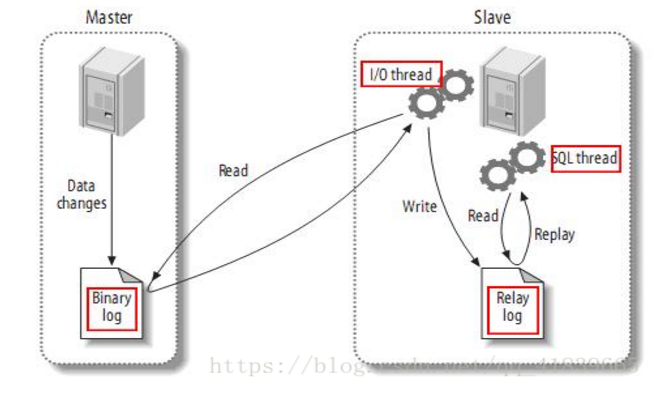

###分表设计
 * 场景：对于大型的互联网应用来说，数据库单表的记录行数可能达到千万级甚至是亿级，并且数据库面临着极高的并发访问。采用Master-Slave复制模式的MySQL架构，
只能够对数据库的读进行扩展，而对数据库的写入操作还是集中在Master上，并且单个Master挂载的Slave也不可能无限制多，Slave的数量受到Master能力和负载的限制。
因此，需要对数据库的吞吐能力进行进一步的扩展，以满足高并发访问与海量数据存储的需要！

####对于访问极为频繁且数据量巨大（几百万）的单表来说，我们首先要做的就是**减少单表的记录条数**，以便减少数据查询所需要的时间，提高数据库的吞吐，这就是所谓的分表！

用户id是最常用的分表字段。因为大部分查询都需要带上用户id，这样既不影响查询，又能够使数据较为均衡地
分布到各个表中(当然，有的场景也可能会出现冷热数据分布不均衡的情况)

假设有一张表记录用户购买信息的订单表order，由于order表记录条数太多，将被拆分成256张表。
拆分的记录根据user_id%256取得对应的表进行存储，前台应用则根据对应的user_id%256，找到对应订单存储的表进行访问。
这样一来，user_id便成为一个必需的查询条件，否则将会由于无法定位数据存储的表而无法对数据进行访问

###分库设计
- 场景：分表能够解决单表数据量过大带来的查询效率下降的问题，但是，却无法给数据库的并发处理能力带来质的提升。面对高并发的读写访问，当数据库master
服务器无法承载写操作压力时，不管如何扩展slave服务器，此时都没有意义了。
因此，我们必须换一种思路，对数据库进行拆分，从而提高数据库写入能力，这就是所谓的分库!

与分表策略相似，分库可以采用通过一个关键字取模的方式，来对数据访问进行路由

###分库分表设计
- 场景：有时数据库可能既面临着高并发访问的压力，又需要面对海量数据的存储问题，这时需要对数据库既采用分表策略，又采用分库策略，以便同时扩展系统的
  并发处理能力，以及提升单表的查询性能，这就是所谓的分库分表。
- 路由策略
1. 中间变量 = user_id % (分库数量 * 每个库的表数量)

2. 库 = 取整数 (中间变量 / 每个库的表数量)

3. 表 = 中间变量 % 每个库的表数量

####分库与分表主要用于应对当前互联网常见的两个场景：海量数据和高并发

###分库与分表带来的分布式困境与应对之策
- 数据迁移与扩容问题
 
水平分表策略归纳总结为随机分表和连续分表两种情况。连续分表有可能存在数据热点的问题，有些表可能会被频繁地查询从而造成较大压力，热数据的表就成为了整个库的瓶颈，而有些表可能存的是历史数据，很少需要被查询到。连续分表的另外一个好处在于比较容易，不需要考虑迁移旧的数据，只需要添加分表就可以自动扩容。随机分表的数据相对比较均匀，不容易出现热点和并发访问的瓶颈。但是，分表扩展需要迁移旧的数据。
针对于水平分表的设计至关重要，需要评估中短期内业务的增长速度，对当前的数据量进行容量规划，综合成本因素，推算出大概需要多少分片。对于数据迁移的问题，一般做法是通过程序先读出数据，然后按照指定的分表策略再将数据写入到各个分表中。

- 表关联问题

在单库单表的情况下，联合查询是非常容易的。但是，随着分库与分表的演变，联合查询就遇到跨库关联和跨表关系问题。在设计之初就应该尽量避免联合查询，可以通过程序中进行拼装，或者通过反范式化设计进行规避。

- 分页与排序问题

一般情况下，列表分页时需要按照指定字段进行排序。在单库单表的情况下，分页和排序也是非常容易的。但是，随着分库与分表的演变，也会遇到跨库排序和跨表排序问题。为了最终结果的准确性，需要在不同的分表中将数据进行排序并返回，并将不同分表返回的结果集进行汇总和再次排序，最后再返回给用户。

- 分布式事务问题

随着分库与分表的演变，一定会遇到分布式事务问题，那么如何保证数据的一致性就成为一个必须面对的问题。目前，分布式事务并没有很好的解决方案，难以满足数据强一致性，一般情况下，使存储数据尽可能达到用户一致，保证系统经过一段较短的时间的自我恢复和修正，数据最终达到一致。

- 分布式全局唯一ID

在单库单表的情况下，直接使用数据库自增特性来生成主键ID，这样确实比较简单。在分库分表的环境中，数据分布在不同的分表上，不能再借助数据库自增长特性。需要使用全局唯一 ID，例如 UUID、GUID等。

###传统数据库中存在的问题

1. 传统数据库设计时,如果服务器宕机,将不能为用户提供服务导致整个系统崩溃.

2. 如果数据库突然宕机.会导致数据丢失.

3. 为了防止数据丢失,要进行实时备份

- 冷备份:
    - 通过数据库工具进行人为的导出sql.但是手动导出数据可能在中间节点宕机时也会造成数据库的丢失.

- 热备份:
    - 通过程序进行控制,定时转储.尽可能的保证数据的完整性.但是还有大量的问题.

###主从复制与读写分离
###[mysql 读写分离](https://blog.csdn.net/u013421629/article/details/78793966)

###主从复制

- 同步复制:
    - 所谓的同步复制，意思是master的变化，必须等待slave-1,slave-2,...,slave-n完成后才能返回。 这样，显然不可取，也不是MySQL复制的默认设置。比如，在WEB前端页面上，用户增加了条记录，需要等待很长时间。
- 异步复制:
    - 如同AJAX请求一样。master只需要完成自己的数据库操作即可。至于slaves是否收到二进制日志，是否完成操作，不用关心,MySQL的默认设置。
- 半同步复制:
    - master只保证slaves中的一个操作成功，就返回，其他slave不管。 这个功能，是由google为MySQL引入的。

####1.角色划分:

主库Master:主要进行的是数据的"更新操作"

从库Slave: 实时备份主库的更新信息

二进制日志:实时记录主库的更新操作,并且形式二进制码.

中继日志:  保存主库的更新信息

####2.调用原理

1. 当主库更新数据后,会实时的写入到二进制日志文件中

2. 从库的IO线程,实时的监听主库的二进制文件,如果二进制文件发送了改变则启动线程进行读取修改后的内容.

3. 通过IO线程将读取的二进制文件写入到中继日志中.

4. Sql线程实时读取中继日志中的消息,进行数据库的"更新操作"

###数据库的读写分离

- 说明:
    - 由于数据库没有优化,会导致主数据库的压力较大.

- 策略:
    - 如果是读的操作,都访问从数据库.
    - 如果是写的操作.都访问主数据库.
    
