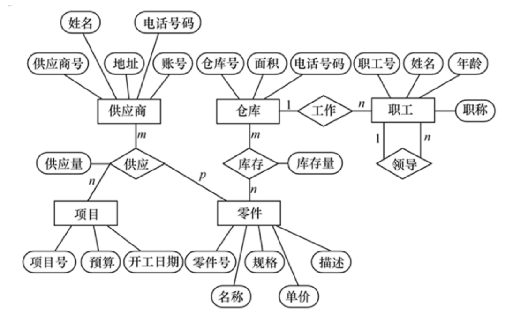

###三大范式
第1范式：每个表中都有1列，并且该列是不可拆分的最小单元（强调的是列的原子性，即列不能够再分成其他几列）

第2范式：1张表只描述一件事情（非主键列是否完全依赖于主键，还是依赖于主键的一部分）

第3范式：用外键做表的关联（非主键列是直接依赖于主键，还是直接依赖于非主键列）

###数据库五大约束

1. primary KEY:设置主键约束；
2. UNIQUE：设置唯一性约束，不能有重复值；
3. DEFAULT 默认值约束，height DOUBLE(3,2)DEFAULT 1.2 height不输入是默认为1,2
4. NOT NULL：设置非空约束，该字段不能为空；
5. FOREIGN key :设置外键约束。

###E-R图
####一、那么什么是E-R模型？

　E-R模型即实体-联系模型，E-R模型的提出基于这样一种认识，数据库总是存储现实世界中有意义的数据，而现实世界是由一组实体和实体的联系组，E-R模型可以成功描述数据库所存储的数据。

####二、为什么要设计E-R模型？

　设计E-R模型能够更有效和更好的模拟现实世界。

####三、E-R模型的基本要素

1) 实体 ：实体是E-R模型的基本对象，是现实世界中各种事物的抽象，凡是可以相互区别，并可以被识别的事、物概念等均可认为是实体。在一个单位中，具有共性的一类实体可以划分为一个实体集，例如，学生李明，黄颖等都是实体，为了便于描述，可以定义学生这样的一个实体集，所有学生都是这个集合的成员。
 
2) 属性：每个实体都具有各种特征，称其为实体的属性，如学生有学号，姓名，年龄等属性。实体的属性值是数据库存储的主要数据。能唯一标识实体的属性或属性组称为实体键，如一个实体有多个键存在。则可从中选取一个作为主键。

3) 联系：实体间会存在各种关系，如人与人之间可能存在领导与雇员关系等，实体间的关系被抽象为联系。

####四、E-R图的四个组成的部分

- 矩形框:表示实体，在矩形框中写上实体的名字

- 椭圆形框:表示实体或联系的属性

- 菱形框:表示联系，在框中记入联系名

- 连线:实体与属性之间；实体与联系之间；联系与属性之间用直线相连，（对于一对一联系，要在两个实体连线方向各写1； 对于一对多联系，要在一的一方写1，多的一方写N；对于多对多关系，则要在两个实体连线方向各写N,M。)。

###E-R图
