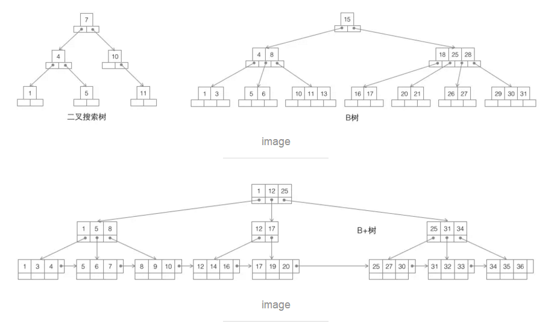
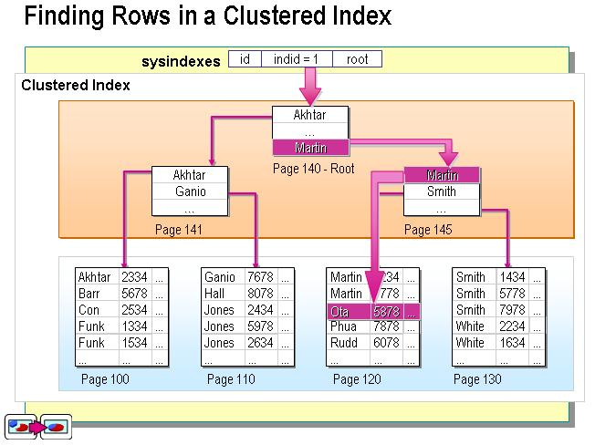
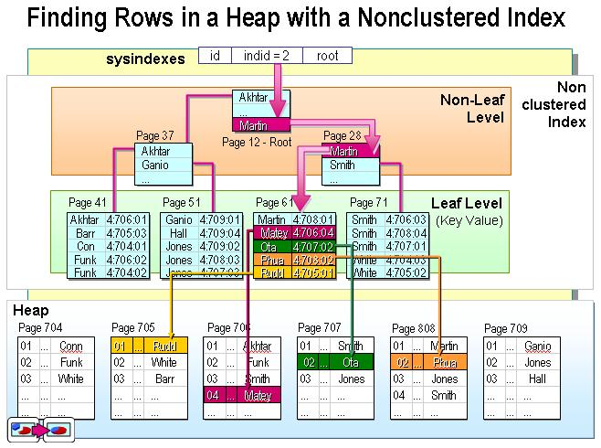

###数据库索引

- 索引（Index）是帮助MySQL高效获取数据的数据结构

```$xslt
CREATE INDEX mytable_categoryid ON mytable (category_id);
```

####索引的类型：

- UNIQUE(唯一索引)：不可以出现相同的值，可以有NULL值
- INDEX(普通索引)：允许出现相同的索引内容
- PRIMARY KEY(主键索引)：不允许出现相同的值
- fulltext index(全文索引)：可以针对值中的某个单词，但效率确实不敢恭维
- 组合索引：实质上是将多个字段建到一个索引里，列值的组合必须唯一，MySQL组合索引“最左前缀”
    - 为了更多的提高mysql效率可建立组合索引，遵循“最左前缀”原则。创建复合索引应该将最常用（频率）
    做限制条件的列放在最左边，依次递减。
####索引的原理
[MySQL索引背后的数据结构及算法原理](https://www.cnblogs.com/sanwenyu/p/6129082.html)
[数据库索引原理及优化](https://blog.csdn.net/suifeng3051/article/details/52669644)

###选择B/B+树的原因
- 我们在MySQL中的数据一般是放在磁盘中的，读取数据的时候肯定会有访问磁盘的操作，磁盘中有两个机械运动的部分，分别是盘片旋转和磁臂移动。盘片旋转就是我们市面上所提到的多少转每分钟，而磁盘移动则是在盘片旋转到指定位置以后，移动磁臂后开始进行数据的读写。那么这就存在一个定位到磁盘中的块的过程，而定位是磁盘的存取中花费时间比较大的一块，毕竟机械运动花费的时候要远远大于电子运动的时间。当大规模数据存储到磁盘中的时候，显然定位是一个非常花费时间的过程，但是我们可以通过B树进行优化，提高磁盘读取时定位的效率。
  
- 使用二叉树，由于二叉树深度过大而造成I/O读写过于频繁，进而导致查询效率低下，因而采取多叉树结构，B树的各种操作能使B树保持较低的高度
  
- 为什么B类树可以进行优化呢？我们可以根据B类树的特点，构造一个多阶的B类树，然后在尽量多的在结点上存储相关的信息，保证层数尽量的少，以便后面我们可以更快的找到信息，磁盘的I/O操作也少一些，而且B类树是平衡树，每个结点到叶子结点的高度都是相同，这也保证了每个查询是稳定的。
  
- 总的来说，B/B+树是为了磁盘或其它存储设备而设计的一种平衡多路查找树(相对于二叉，B树每个内节点有多个分支)，与红黑树相比，在相同的的节点的情况下，一颗B/B+树的高度远远小于红黑树的高度(在下面B/B+树的性能分析中会提到)。B/B+树上操作的时间通常由存取磁盘的时间和CPU计算时间这两部分构成，而CPU的速度非常快，所以B树的操作效率取决于访问磁盘的次数，关键字总数相同的情况下B树的高度越小，磁盘I/O所花的时间越少。

###为什么说B+树比B树更适合数据库索引？
1、 B+树的磁盘读写代价更低：B+树的内部节点并没有指向关键字具体信息的指针，因此其内部节点相对B树更小，如果把所有同一内部节点的关键字存放在同一盘块中，那么盘块所能容纳的关键字数量也越多，一次性读入内存的需要查找的关键字也就越多，相对IO读写次数就降低了。

2、B+树的查询效率更加稳定：由于非终结点并不是最终指向文件内容的结点，而只是叶子结点中关键字的索引。所以任何关键字的查找必须走一条从根结点到叶子结点的路。所有关键字查询的路径长度相同，导致每一个数据的查询效率相当。

3、由于B+树的数据都存储在叶子结点中，分支结点均为索引，方便扫库，只需要扫一遍叶子结点即可，但是B树因为其分支结点同样存储着数据，我们要找到具体的数据，需要进行一次中序遍历按序来扫，所以B+树更加适合在区间查询的情况，所以通常B+树用于数据库索引。

数据库索引采用B+树的主要原因是：B树在提高了IO性能的同时并没有解决元素遍历的我效率低下的问题，正是为了解决这个问题，B+树应用而生。B+树只需要去遍历叶子节点就可以实现整棵树的遍历。而且在数据库中基于范围的查询是非常频繁的，而B树不支持这样的操作或者说效率太低。



####B树
* 多路搜索树
* 非叶子节点都存在关键字和指针
####B+树

- B+Tree是mysql使用最频繁的一个索引数据结构，是Inodb和Myisam存储引擎模式的索引类型

* 每个非叶子节点的关键字数等于其孩子数，即关键字数等于指针数

- B+Tree所有索引数据都在叶子节点上，并且增加了顺序访问指针，每个叶子节点都有指向相邻叶子节点的指针。

- 大大减少磁盘I/O读取
    - 数据库系统的设计者巧妙利用了磁盘预读原理，将一个节点的大小设为等于一个页，这样每个节点需要一次I/O就可以完全载入。
  
####索引的优点
* 加快数据的检索速度
* 创建唯一索引，保证数据库表中每一行数据的唯一性
* 加速数据间的连接
* 在使用分组和排序子句进行数据检索时，显著减少查询中分组和排序的时间

####索引的缺点
* 创建索引和维护索引需要耗费时间，这种时间随着数据量的增加而增加
* 索引需要占用物理空间
* 当对表中数据进行增加、删除和修改时，索引也需要维护

####索引的失效
* 条件中有or，即使其中有条件带索引也不会使用
* 对于多列索引，不是使用的第一部分，则索引也会失效
* like查询以%开头
* 如果列类型是字符串，那一定要在条件中使用引号引起来
* 如果mysql引擎估计使用全表扫描比使用索引块，那索引也会失效

####何时使用索引
* 经常出现在order by,group by.distinct后的字段
* 在union等集合操作的结果集字段上
* 经常用作表连接的属性
* 索引覆盖

###Mysql索引主要有两种结构：B+Tree索引和Hash索引
####Hash索引
- mysql中，只有Memory(Memory表只存在内存中，断电会消失，适用于临时表)存储引擎显示支持Hash索引，是Memory表的默认索引类型，尽管Memory表也可以使用B+Tree索引。Hash索引把数据以hash形式组织起来，因此当查找某一条记录的时候，速度非常快。但是因为hash结构，每个键只对应一个值，而且是散列的方式分布。所以它并不支持范围查找和排序等功能。


###索引使用注意事项
1. 索引不会包含有NULL的列

     只要列中包含有NULL值，都将不会被包含在索引中，复合索引中只要有一列含有NULL值，那么这一列对于此符合索引就是无效的。

2. 使用短索引

     对串列进行索引，如果可以就应该指定一个前缀长度。例如，如果有一个char（255）的列，如果在前10个或20个字符内，多数值是唯一的，那么就不要对整个列进行索引。短索引不仅可以提高查询速度而且可以节省磁盘空间和I/O操作。

3. 索引列排序
    
    mysql查询只使用一个索引，因此如果where子句中已经使用了索引的话，那么order by中的列是不会使用索引的。因此数据库默认排序可以符合要求的情况下不要使用排序操作，尽量不要包含多个列的排序，如果需要最好给这些列建复合索引。

4. like语句操作

      一般情况下不鼓励使用like操作，如果非使用不可，注意正确的使用方式。like ‘%aaa%’不会使用索引，而like ‘aaa%’可以使用索引。

5. 不要在列上进行运算

6. 不使用NOT IN 、<>、！=操作，但<,<=，=，>,>=,BETWEEN,IN是可以用到索引的

7. 索引要建立在经常进行select操作的字段上。

   这是因为，如果这些列很少用到，那么有无索引并不能明显改变查询速度。相反，由于增加了索引，反而降低了系统的维护速度和增大了空间需求。

8. 索引要建立在值比较唯一的字段上。

9. 对于那些定义为text、image和bit数据类型的列不应该增加索引。因为这些列的数据量要么相当大，要么取值很少。

10. 在where和join中出现的列需要建立索引。

11. where的查询条件里有不等号(where column != …),mysql将无法使用索引。

12. 如果where字句的查询条件里使用了函数(如：where DAY(column)=…),mysql将无法使用索引。

13. 在join操作中(需要从多个数据表提取数据时)，mysql只有在主键和外键的数据类型相同时才能使用索引，否则及时建立了索引也不会使用。


###聚集索引与非聚集索引的区别
####聚集索引
* 数据行的物理顺序与列值（一般是主键的那一列）的逻辑顺序相同，一个表中只能拥有一个聚集索引。

* 就是按照每张表的主键构造一颗B+树，聚集索引的叶子节点中存放的就是整张表的行记录数据，
也将聚集索引的叶子节点称为数据页，可以直接获取到对应的全部列的数据



####非聚集索引
* 该索引中索引的逻辑顺序与磁盘上行的物理存储顺序不同，一个表中可以拥有多个非聚集索引。

* 非聚集索引强调的是逻辑分类。可以说是定义了一套存储规则，而需要有一块控件来维护这个规则，这个被称之为索引表
* 非聚集索引就像新华字典的偏旁字典，他结构顺序与实际存放顺序不一定一致
* 非聚集索引的二次查询问题，非聚集索引叶节点仍然是索引节点，只是有一个指针指向对应的数据块，此如果使用非聚集索引查询，而查询列中包含了其他该索引没有覆盖的列，那么他还要进行第二次的查询，查询节点上对应的数据行的数据。

