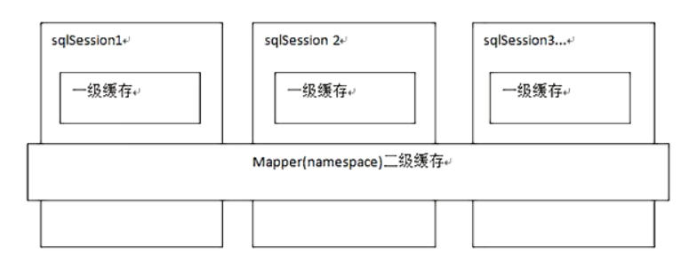
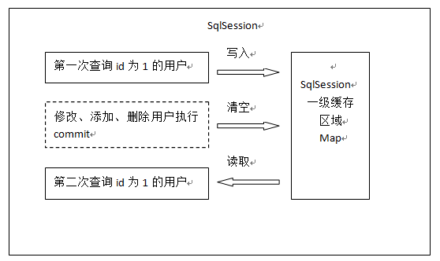
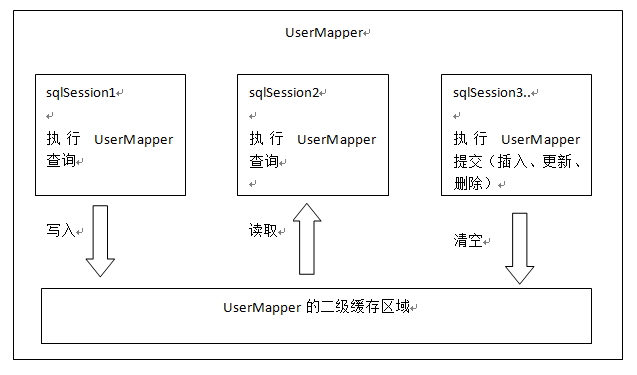

###MyBatis缓存

* 一级缓存 作用域scope：SQLSession会话级别
    * 基于 PerpetualCache 的 HashMap 本地缓存
    * 同一个sqlSession进行两次相同的查询，mybatis只会进行一次数据库操作，第二次查询会命中一级缓存
    * 不同sqlSession进行相同查询，myBatis进行两次数据库查询
    * 同一个sqlSession，查询之后更新数据，再次查询相同的语句，myBatis会进行两次数据库
    查询，一旦执行了新增、更新或删除操作，缓存就会被清除

* 二级缓存 作用域scope：mapper文件的namespace
- 二级缓存 底层还是 HashMap 架构。
- 开启了二级缓存后，还需要将要缓存的pojo实现Serializable接口，为了将缓存数据取出执行反序列化操作，因为二级缓存数据存储介质多种多样，不一定只存在内存中，有可能存在硬盘中，如果我们要再取这个缓存的话，就需要反序列化了。所以mybatis中的pojo都去实现Serializable接口。

和一级缓存默认开启不一样，二级缓存需要我们手动开启

####源码分析
#####Mybatis相关接口了解
* Configuration类：MyBatis全局配置信息类
* SqlSessionFactory接口：操作SqlSession的工厂接口，具体实现类是DefaultSqlSession
* SqlSession接口：执行sql，管理事务的接口，具体的实现类是DefaultSqlSession
* Executor接口：sql执行器，SqlSession执行sql最终是通过该接口实现的，常用的实现类
有SimpleExecutor和CachingExecutor，这些实现类都使用了装饰者模式
#####一级缓存
#####二级缓存
* 作用域是全局的，二级缓存在SqlSession关闭或者提交之后才会生效
* 相关类MappedStatement
* MappedStatement类在MyBatis中用于表示XML文件中一个sql语句节点，即一个‘
<select/>、<update/>或者<insert/>标签，Mybatis框架在初始化阶段会对XML配置文件
进行读取，将其中的sql语句节点对象化为一个个MappedStatement对象
* 二级缓存需要配置 <cache/>即可
* 二级缓存和3个配置有关：
    * Mybatis全局配置文件中的setting中的cacheEnabled需要为true（默认为true）
    * mapper配置文件中需要加入<cache/>节点
    * mapper配置文件中的select节点需要加上属性useCache需要为true（默认为true）
* 不同SqlSession，查询相同语句，第一次查询之后commit SqlSession，MyBatis仅
进行一次数据库查询
* 不同SqlSession，查询相同语句，第一次查询之后close SqlSession。MyBatis仅
进行一次数据库查询
* 不同SqlSession，查询相同语句，第一次查询之后SqlSession不提交，MyBatis执行了
两次数据库查询
* 开启了二级缓存之后，查询数据会先从二级缓存中取数据，如果没有，就去一级缓存中取，
如果一级缓存中也没有的话再查询数据库