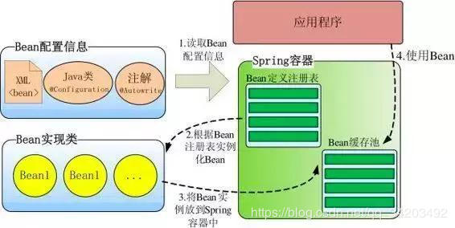

###IOC
- Inversion of Control，即控制反转，传统Java SE程序设计，我们直接在对象内部通过new进行创建对象，
是程序主动去创建依赖对象；而IOC是有专门一个容器来创建这些对象，即由IOC容器来控制对象的创建；
所谓IoC，对于spring框架来说，就是由spring来负责控制对象的生命周期和对象间的关系。

- IOC的一个重点是在系统运行中，动态的向某个对象提供它所需要的其他对象。这一点是通过DI
（Dependency Injection，依赖注入）来实现的。

###依赖注入的方式：

* 构造器注入：在配置文件中配置该类的bean，并配置构造器，在配置构造器中用到了<constructor-arg>节点，
    - 该节点有四个属性：
        - index是索引，指定注入的属性，从0开始，如：0代表personDao，1代表str属性；
        - type是指该属性所对应的类型；
        - ref 是指引用的依赖对象；
        - value 当注入的不是依赖对象，而是基本数据类型时，就用value；

* 使用属性的setter方法注入

```aidl
<!-- 属性注入 -->
<bean id="car" class="com.spring.model.Car">  
    <property name="maxSpeed" value="200"></property>
    <property name="brand" value="红旗CA72"></property>  
    <property name="price" value="200000.00"></property>
</bean>
```

```aidl
/**
 * 属性注入
 */
@Test
public void test(){
    //读取配置文件
    ApplicationContext ctx=new ClassPathXmlApplicationContext("applicationContext.xml");
    //获取bean的实例
    Car car=(Car) ctx.getBean("car");
    car.run();
}
```

- 使用Filed注入（用于注解方式）


###Ioc容器的初始化
- Ioc容器的初始化是由refresh（）方法来启动的，这个方法标志着Ioc容器的正式启动。
启动过程包括三个基本过程：

1. BeanDifinition的Resource定位
    - 这个Resource定位指的是BeanDifinition的资源定位，它由ResourceLoader通过统一的Resource接口来完成，这个Resource对各种形式的BeanDifinition的使用都提供了统一的接口
    
2. BeanDifinition的载入与解析
    - 这个载入过程是把用户定义好的Bean表示成Ioc容器内部的数据结构，而这个容器内部的数据结构就是BeanDifinition。具体来说，BeanDifinition实际上就是POJO对象在IOC容器中的抽象，通过这个BeanDifinition定义的数据结构，使IOC容器能够方便的对POJO对象也就是Bean进行管理。
    
3. BeanDifinition在Ioc容器中的注册
    - 这个操作是通过调用BeanDifinitionRegistry借口来实现的。这个注册过程把载入过程中解析得到的BeanDifinition向Ioc容器进行注册。在阅读源码中可知，在IOC容器内部将BeanDifinition注入到一个HashMap中去，Ioc容器就是通过这个HashMap来持有这些BeanDifinition数据的。

- 做完这3步，bean就在SpringIoC容器中被定义了，
而没有被初始化，更没有完成依赖注入，也就没有注入其配置的资源给Bean，那么它还不能完全使用。

###Spring IOC加载全过程


- 包括容器初始化，bean的初始化、实例化、属性注入

1. Application加载xml
2. AbstractApplicationContext的refresh函数载入Bean定义过程
3. AbstractApplicationContext子类的refreshBeanFactory()方法
4. AbstractRefreshableApplicationContext子类的loadBeanDefinitions方法
5. AbstractBeanDefinitionReader读取Bean定义资源
6. 资源加载器获取要读入的资源
7. XmlBeanDefinitionReader加载Bean定义资源
8. DocumentLoader将Bean定义资源转换为Document对象
9. XmlBeanDefinitionReader解析载入的Bean定义资源文件
10. DefaultBeanDefinitionDocumentReader对Bean定义的Document对象解析
11. BeanDefinitionParserDelegate解析Bean定义资源文件中的元素
12. BeanDefinitionParserDelegate解析元素
13. 解析元素的子元素
14. 解析子元素
15. 解析过后的BeanDefinition在IoC容器中的注册（IoC容器的初始化结束）
16. DefaultListableBeanFactory向IoC容器注册解析后的BeanDefinition（依赖注入开始）
17. AbstractBeanFactory通过getBean向IoC容器获取被管理的Bean
18. AbstractAutowireCapableBeanFactory创建Bean实例对象
19. createBeanInstance方法创建Bean的java实例对象
20. SimpleInstantiationStrategy类使用默认的无参构造方法创建Bean实例化对象
21. populateBean方法对Bean属性的依赖注入
22. BeanDefinitionValueResolver解析属性值
23. BeanWrapperImpl对Bean属性的依赖注入

###Bean的生命周期
- Spring Bean的完整生命周期从创建Spring容器开始，直到最终Spring容器销毁Bean

- Bean的完整生命周期经历了各种方法调用，这些方法可以划分为以下几类：

1、Bean自身的方法
    - 这个包括了Bean本身调用的方法和通过配置文件中<bean>的init-method和destroy-method指定的方法

2、Bean级生命周期接口方法
    - 这个包括了BeanNameAware、BeanFactoryAware、InitializingBean和DiposableBean这些接口的方法

3、容器级生命周期接口方法
    - 这个包括了InstantiationAwareBeanPostProcessor 和 BeanPostProcessor 这两个接口实现，一般称它们的实现类为“后处理器”。

4、工厂后处理器接口方法
    - 这个包括了AspectJWeavingEnabler, ConfigurationClassPostProcessor, CustomAutowireConfigurer等等非常有用的工厂后处理器　　接口的方法。工厂后处理器也是容器级的。在应用上下文装配配置文件之后立即调用。


0、当调用者通过 getBean（ name ）向 容器寻找Bean 时，如果容器注册了 org.springframework.beans.factory.config.InstantiationAwareBeanPostProcessor接口，在实例 bean 之前，将调用该接口的 postProcessBeforeInstantiation （）方法，

1、实例化一个Bean－－也就是我们常说的new；

2、按照Spring上下文对实例化的Bean进行配置－－也就是IOC注入；

3、如果这个Bean已经实现了BeanNameAware接口，会调用它实现的setBeanName(String)方法，此处传递的就是Spring配置文件中Bean的id值

4、如果这个Bean已经实现了BeanFactoryAware接口，会调用它实现的setBeanFactory(setBeanFactory(BeanFactory)传递的是Spring工厂自身（可以用这个方式来获取其它Bean，只需在Spring配置文件中配置一个普通的Bean就可以）；

5、(应用Spring上下文bean)如果这个Bean已经实现了ApplicationContextAware接口，会调用setApplicationContext(ApplicationContext)方法，传入Spring上下文（同样这个方式也可以实现步骤4的内容，但比4更好，因为ApplicationContext是BeanFactory的子接口，有更多的实现方法）；

6、如果这个Bean关联了BeanPostProcessor接口，将会调用postProcessBeforeInitialization(Object obj, String s)方法，BeanPostProcessor经常被用作是Bean内容的更改，并且由于这个是在Bean初始化结束时调用那个的方法，也可以被应用于内存或缓存技术；

7、如果Bean在Spring配置文件中配置了init-method属性会自动调用其配置的初始化方法。

8、如果这个Bean关联了BeanPostProcessor接口，将会调用postProcessAfterInitialization(Object obj, String s)方法、；

注：以上工作完成以后就可以应用这个Bean了，那这个Bean是一个Singleton的，所以一般情况下我们调用同一个id的Bean会是在内容地址相同的实例，当然在Spring配置文件中也可以配置非Singleton，这里我们不做赘述。

9、当Bean不再需要时，会经过清理阶段，如果Bean实现了DisposableBean这个接口，会调用那个其实现的destroy()方法；

10、最后，如果这个Bean的Spring配置中配置了destroy-method属性，会自动调用其配置的销毁方法。


