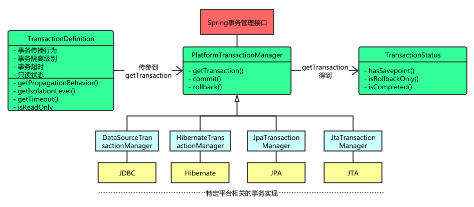

###Spring事务管理
- 编程式事务管理： 
    - 所谓编程式事务指的是通过编码方式实现事务，允许用户在代码中精确定义事务的边界。
    - 编程式事务管理使用TransactionTemplate或者直接使用底层的PlatformTransactionManager。对于编程式事务管理，spring推荐使用TransactionTemplate。 
    - 以代码的方式管理事务，事务将由开发者通过自己的代码来实现  

- 声明式事务管理： 
    - 管理建立在AOP之上的。其本质是对方法前后进行拦截，然后在目标方法开始之前创建或者加入一个事务，
    在执行完目标方法之后根据执行情况提交或者回滚事务。
    
    - 声明式事务最大的优点就是不需要通过编程的方式管理事务，这样就不需要在业务逻辑代码中掺杂事务管理的代码，
    只需在配置文件中做相关的事务规则声明(或通过基于@Transactional注解的方式)，便可以将事务规则应用到业务逻辑中。

- 声明式事务的流程
    - Spring Ioc容器启动完成，解析事务管理的内容，存放到事务定义器之内
    - 根据事务定义器，设置事务属性
    - 执行开发者的代码逻辑，若异常或满足事务回滚条件，则事务回滚，
    若没有则事务提交
   
   

 
- Spring并不直接管理事务，而是提供了多种事务管理器 ，他们将事务管理的职责委托给Hibernate或者JTA等持久化机制所提供的相关平台框架的事务来实现。

###PlatformTransactionManager事务管理器

- 事务管理器接口 PlatformTransactionManager 通过 getTransaction(TransactionDefinition definition) 方法来得到
一个事务，这个方法里面的参数是 TransactionDefinition类 ，

###TransactionDefinition类定义了一些基本的事务属性：
- 隔离级别
- 传播行为
- 回滚规则
- 是否只读
- 事务超时
    
###事务隔离级别
- 定义了一个事务可能受其他并发事务影响的程度

###事务传播行为
- 为了解决业务层方法之间互相调用的事务问题
- 一个方法调度另一个方法时，可以对事务的特性进行传播配置，称为传播行为
- PROPAGATION_REQUIRED ：required , 必须。默认值，A如果有事务，B将使用该事务；如果A没有事务，B将创建一个新的事务。
- PROPAGATION_REQUIRES_NEW ：requires_new，必须新的。如果A有事务，将A的事务挂起，B创建一个新的事务；如果A没有事务，B创建一个新的事务。
- PROPAGATION_NESTED ：nested ，嵌套。A和B底层采用保存点机制，形成嵌套事务。若数据库不支持保存点，则和REQUIRED_NEW一样

###回滚规则
- 定义事务回滚规则
- 这些规则定义了哪些异常会导致事务回滚而哪些不会。

###事务只读属性
- 对事物资源是否执行只读操作

###事务超时属性
- 一个事务允许执行的最长时间

###TransactionStatus事务状态
- getTransaction(),这个方法返回的是 TransactionStatus对象，然后程序根据返回的对象来获取事务状态，然后进行相应的操作。
- 这个接口描述的是一些处理事务提供简单的控制事务执行和查询事务状态的方法，在回滚或提交的时候需要应用对应的事务状态。

