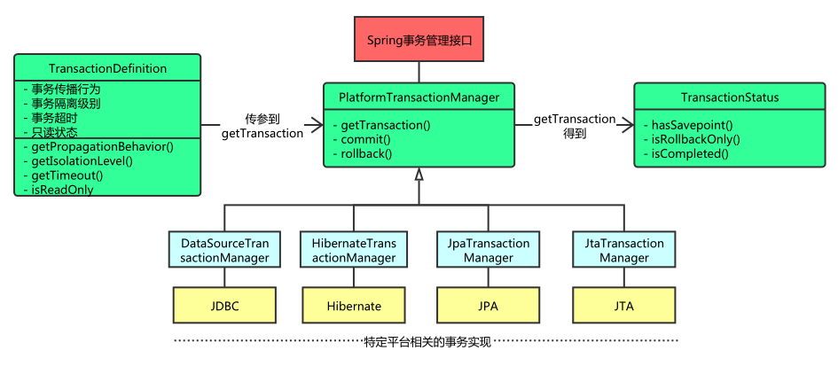
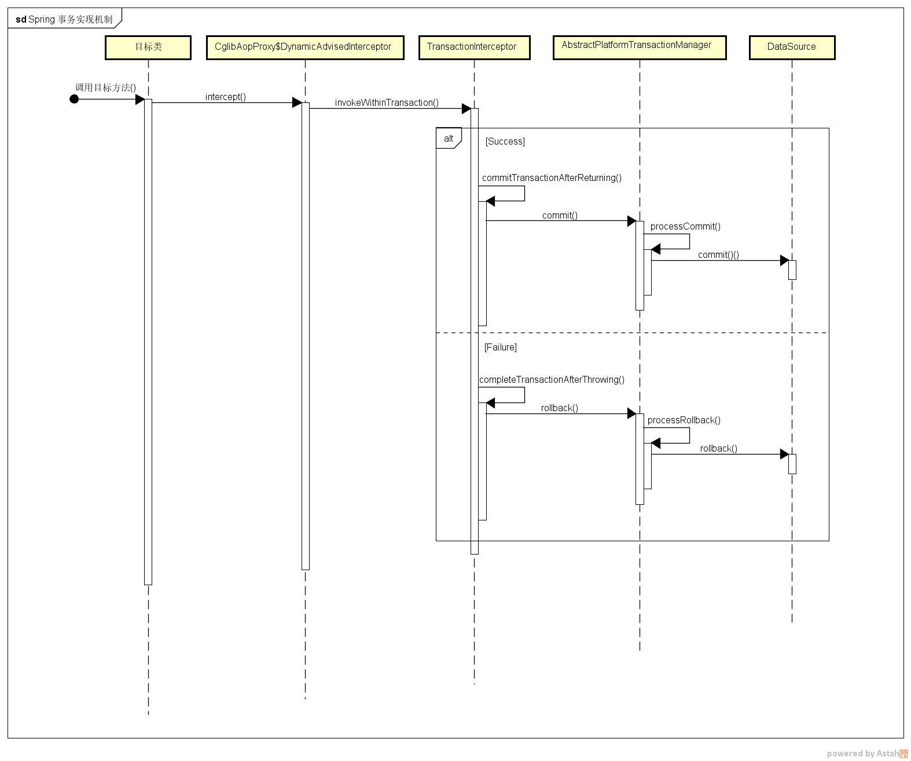
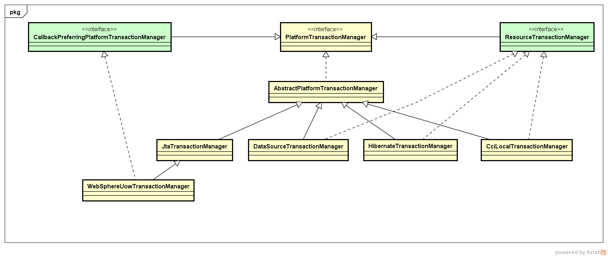

###Spring事务管理
- 编程式事务管理： 
    - 所谓编程式事务指的是通过编码方式实现事务，允许用户在代码中精确定义事务的边界。
    - 编程式事务管理使用TransactionTemplate或者直接使用底层的PlatformTransactionManager。
    - 对于编程式事务管理，spring推荐使用TransactionTemplate。 
    - 以代码的方式管理事务，事务将由开发者通过自己的代码来实现  

- 声明式事务管理： 
    - 管理建立在AOP之上的。其本质是对方法前后进行拦截，然后在目标方法开始之前创建或者加入一个事务，
    在执行完目标方法之后根据执行情况提交或者回滚事务。
    
    - 声明式事务最大的优点就是不需要通过编程的方式管理事务，这样就不需要在业务逻辑代码中掺杂事务管理的代码，
    只需在配置文件中做相关的事务规则声明(或通过基于@Transactional注解的方式)，便可以将事务规则应用到业务逻辑中。

- 声明式事务的流程
    - Spring Ioc容器启动完成，解析事务管理的内容，存放到事务定义器之内
    - 根据事务定义器，设置事务属性
    - 执行开发者的代码逻辑，若异常或满足事务回滚条件，则事务回滚，
    若没有则事务提交
   
   

 
- Spring并不直接管理事务，而是提供了多种事务管理器 ，他们将事务管理的职责委托给Hibernate或者JTA等持久化机制所提供的相关平台框架的事务来实现。

###PlatformTransactionManager事务管理器

- 事务管理器接口 PlatformTransactionManager 通过 getTransaction(TransactionDefinition definition) 方法来得到
一个事务，这个方法里面的参数是 TransactionDefinition类 ，

###TransactionDefinition类定义了一些基本的事务属性：
- 隔离级别
- 传播行为
- 回滚规则
- 是否只读
- 事务超时
    
###事务隔离级别
- 定义了一个事务可能受其他并发事务影响的程度

###事务传播行为
- 为了解决业务层方法之间互相调用的事务问题
- 一个方法调度另一个方法时，可以对事务的特性进行传播配置，称为传播行为
- PROPAGATION_REQUIRED ：required , 必须。默认值，A如果有事务，B将使用该事务；如果A没有事务，B将创建一个新的事务。
- PROPAGATION_REQUIRES_NEW ：requires_new，必须新的。如果A有事务，将A的事务挂起，B创建一个新的事务；如果A没有事务，B创建一个新的事务。
- PROPAGATION_NESTED ：nested ，嵌套。A和B底层采用保存点机制，形成嵌套事务。若数据库不支持保存点，则和REQUIRED_NEW一样

###回滚规则
- 定义事务回滚规则
- 这些规则定义了哪些异常会导致事务回滚而哪些不会。

###事务只读属性
- 对事物资源是否执行只读操作

###事务超时属性
- 一个事务允许执行的最长时间

###TransactionStatus事务状态
- getTransaction(),这个方法返回的是 TransactionStatus对象，然后程序根据返回的对象来获取事务状态，然后进行相应的操作。
- 这个接口描述的是一些处理事务提供简单的控制事务执行和查询事务状态的方法，在回滚或提交的时候需要应用对应的事务状态。

###@Transactional 事务实现机制
- 在应用系统调用声明了 @Transactional 的目标方法时，Spring Framework 默认使用 AOP 代理，在代码运行时生成一个代理对象，根据 @Transactional 的属性配置信息，这个代理对象决定该声明 @Transactional 的目标方法是否由拦截器 TransactionInterceptor 来使用拦截，在 TransactionInterceptor 拦截时，会在目标方法开始执行之前创建并加入事务，并执行目标方法的逻辑, 最后根据执行情况是否出现异常，利用抽象事务管理器 AbstractPlatformTransactionManager 操作数据源 DataSource 提交或回滚事务。
  
- Spring AOP 代理有 CglibAopProxy 和 JdkDynamicAopProxy 两种，以 CglibAopProxy 为例，对于 CglibAopProxy，需要调用其内部类的 DynamicAdvisedInterceptor 的 intercept 方法。对于 JdkDynamicAopProxy，需要调用其 invoke 方法。

- 正如上文提到的，事务管理的框架是由抽象事务管理器 AbstractPlatformTransactionManager 来提供的，而具体的底层事务处理实现，由 PlatformTransactionManager 的具体实现类来实现，如事务管理器 DataSourceTransactionManager。不同的事务管理器管理不同的数据资源 DataSource，比如 DataSourceTransactionManager 管理 JDBC 的 Connection。

- 注意点： 
    - @Transactional既可以作用于接口，接口方法上
    以及类已经类的方法上。但是Spring官方不建议接口
    或者接口方法上使用该注解，因为这只有在使用基于
    接口的代理时它才会生效。
    - 另外， @Transactional 注解应该只被应用到 
    public 方法上，这是由 Spring AOP 的本质决定的。如果你在 protected、private 或者默认可见性的方法上使用 @Transactional 注解，这将被忽略，也不会抛出任何异常。 Spring默认使用的是jdk自带的基于接口的代理，而没有使用基于类的代理CGLIB。

- 重点注意点： @Transactional注解底层使用的是动态代理来进行实现的，如果在调用本类中的方法，此时不添加@Transactional注解，而是在调用类中使用thisi调用本类中的另外一个添加了@Transactional注解，此时this调用的方法上的@Transactional注解是不起作用的。

- 在默认的代理模式下，只有目标方法由外部调用，才能被 Spring 的事务拦截器拦截。在同一个类中的两个方法直接调用，是不会被 Spring 的事务拦截器拦截，

