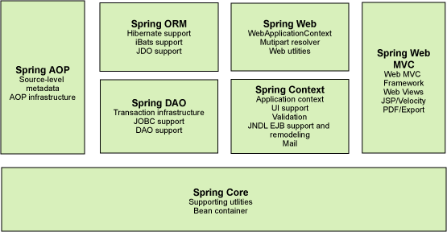

###总体（七大模块）
Spring是一个开源的容器框架，Spring可以接管Web层，业务层，Dao层，持久层组件。主要负责创建Bean以及维护Bean之间的关系。

- Spring Core：
    - Core封装包是框架的最基础部分，提供IOC和依赖注入特性。
这里的基础概念是BeanFactory，它提供对Factory模式的经典实现来消除对程序性单例模式的需要，
并真正地允许你从程序逻辑中分离出依赖关系和配置。 

- Spring Context:
    - 构建于Core封装包基础上的 Context封装包，提供了一种框架式的对象访问方法，有些象JNDI注册器。
Context封装包的特性得自于Beans封装包，并添加了对国际化（I18N）的支持（例如资源绑定），事件传播，资源装载的方式和Context的透明创建，比如说通过Servlet容器。 

- Spring DAO: 
    - DAO (Data Access Object)提供了JDBC的抽象层，它可消除冗长的JDBC编码和解析数据库厂商特有的错误代码。 
并且，JDBC封装包还提供了一种比编程性更好的声明性事务管理方法，不仅仅是实现了特定接口，
而且对所有的POJOs（plain old Java objects）都适用。

- Spring ORM: 
    - ORM 封装包提供了常用的“对象/关系”映射APIs的集成层。 
其中包括JPA、JDO、Hibernate 和 iBatis 。
利用ORM封装包，可以混合使用所有Spring提供的特性进行“对象/关系”映射，如前边提到的简单声明性事务管理。 

- Spring AOP: 
    - Spring的 AOP 封装包提供了符合AOP Alliance规范的面向方面的编程实现，让你可以定义，
例如方法拦截器（method-interceptors）和切点（pointcuts），从逻辑上讲，从而减弱代码的功能耦合，清晰的被分离开。
而且，利用source-level的元数据功能，还可以将各种行为信息合并到你的代码中。 

- Spring Web: 
    - Spring中的 Web 包提供了基础的针对Web开发的集成特性，
例如多方文件上传，利用Servlet listeners进行IOC容器初始化和针对Web的ApplicationContext。
当与WebWork或Struts一起使用Spring时，这个包使Spring可与其他框架结合。

- Spring Web MVC: 
    - Spring中的MVC封装包提供了Web应用的Model-View-Controller（MVC）实现。
Spring的MVC框架并不是仅仅提供一种传统的实现，它提供了一种清晰的分离模型，在领域模型代码和Web Form之间。
并且，还可以借助Spring框架的其他特性。

###IOC
- Inversion of Control，即控制反转，传统Java SE程序设计，我们直接在对象内部通过new进行创建对象，
是程序主动去创建依赖对象；而IOC是有专门一个容器来创建这些对象，即由IOC容器来控制对象的创建；
所谓IoC，对于spring框架来说，就是由spring来负责控制对象的生命周期和对象间的关系。

- IOC的一个重点是在系统运行中，动态的向某个对象提供它所需要的其他对象。这一点是通过DI
（Dependency Injection，依赖注入）来实现的。

- 依赖注入的方式：
    * 构造器注入：在配置文件中配置该类的bean，并配置构造器，在配置构造器中用到了<constructor-arg>节点，
    该节点有四个属性：
        - index是索引，指定注入的属性，从0开始，如：0代表personDao，1代表str属性；
        - type是指该属性所对应的类型；
        - ref 是指引用的依赖对象；
        - value 当注入的不是依赖对象，而是基本数据类型时，就用value；
    * 使用属性的setter方法注入
    * 使用字段（Filed注入）注解方式
@Resource
@Autowired + @Qualifier
@Autowired默认按类型装配，@Resource默认按名称装配，用@Resource进行依赖注入，它先会根据指定的name属性去Spring容器
中寻找与该名称匹配的对象，例如：@Resource(name="userDao")，如果没有找到该名称，则会按照类型去寻找，
<context:annotation-config>处理@autowired之类的注解（共有四类）前提是注解作用的类已经被注册到spring容器里
（bean id="" class=""） 
<context:component-scan>除了包含<context:annotation-config>的作用外，还能自动扫描和注册base-package下有
@component之类注解的类，将其作为bean注册到spring容器里
所以配置文件如果有<context:component-scan>就不需要<context:annotation-config>了。

###Spring AOP实现事务
- 首先从DataSource由谁管理入手，在Spring中配置了一个DataSourceTransactionManager对象，会将DataSource注入到这个对象中。
- 接下来是TransactionInterceptor，它看起来有点像拦截器了，他将transactionManager包装进去了；
TransactionInterceptor的invoke方法
这个方法中会调用一个createTransactionIfNecessary方法，createTransactionIfNecessary会调用之前包装进去的DataSourceTransactionManager
的getTransaction方法，如果发现事务对象获取到就直接返回，否则会做一个doBegin的操作，这类关键字一般是指切入时的预先操作：
将connection做了一个setAutoCommit(false);非自动提交模式，
connection会与本线程绑定起来。

###Spring的注解：
@Component
@Controller
@Service
@Repository
@Autowired + @qualifier
@Resource
@Scope用于指定scope作用域的（用在类上）

###Spring的作用域：
* singleton 单例模式，在整个Spring IOC容器中，使用singleton定义的Bean将只有一个实例
* prototype 原型模式，每次通过容器的getBean方法获取prototype定义的Bean时，都将产生一个新的Bean实例
* request：对于每次HTTP请求，使用request定义的Bean都将产生一个新实例，即每次HTTP请求将会产生不同的Bean实例。
只有在Web应用中使用Spring时，该作用域才有效
* session：针对http session起作用，Spring容器会根据该Bean的定义来创建一个全新的Bean的实例。
而且该Bean只在当前http session内是有效的。同样只有在Web应用中使用Spring时，该作用域才有效
* globalSession：与session大体相同，但仅在portlet应用中使用。

