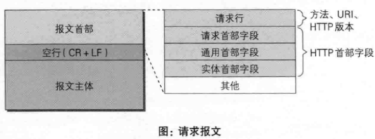
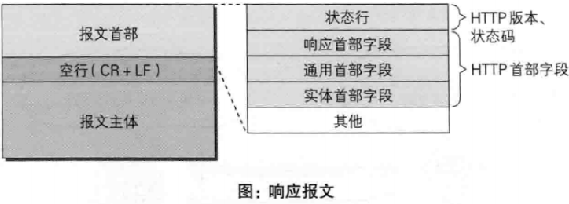

###HTTP:Hyper Text Transfer Protocol 超文本传输协议
* 是一个基于TCP/IP通信协议的应用层协议
* 主要特点：简单快捷、灵活、无连接、无状态
* Request请求包括请求行、请求头、空行、请求数据
* 请求行由请求方法字段、URL字段和HTTP协议版本字段3个字段组成

####无状态协议理解
- 无状态协议对于事务处理没有记忆能力
- 可以使用Cookie来解决无状态的问题

####Http与Https的区别：
- HTTP 的URL 以http:// 开头，而HTTPS 的URL 以https:// 开头
- HTTP 是不安全的，而 HTTPS 是安全的
- HTTP 标准端口是80 ，而 HTTPS 的标准端口是443
- 在OSI 网络模型中，HTTP工作于应用层，而HTTPS 的安全传输机制工作在传输层
- HTTP 无法加密，而HTTPS 对传输的数据进行加密
- HTTP无需证书，而HTTPS 需要CA机构wosign的颁发的SSL证书

> HTTPS就是HTTP加上加密处理（一般是SSL安全通信线路）+认证+完整性保护
####请求报文

####响应报文

####常见的首部：

- 通用首部字段（请求报文与响应报文都会使用的首部字段）
    - Date：创建报文时间
    - Connection：连接的管理
    - Cache-Control：缓存的控制
    - Transfer-Encoding：报文主体的传输编码方式
- 请求首部字段（请求报文会使用的首部字段）
    - Host：请求资源所在服务器
    - Accept：可处理的媒体类型
    - Accept-Charset：可接收的字符集
    - Accept-Encoding：可接受的内容编码
    - Accept-Language：可接受的自然语言
- 响应首部字段（响应报文会使用的首部字段）
    - Accept-Ranges：可接受的字节范围
    - Location：令客户端重新定向到的URI
    - Server：HTTP服务器的安装信息
- 实体首部字段（请求报文与响应报文的的实体部分使用的首部字段）
    - Allow：资源可支持的HTTP方法
    - Content-Type：实体主类的类型
    - Content-Encoding：实体主体适用的编码方式
    - Content-Language：实体主体的自然语言
    - Content-Length：实体主体的的字节数
    - Content-Range：实体主体的位置范围，一般用于发出部分请求时使用

####请求头：
* Accept： 浏览器可接受的MIME类型
* Accept-Charset：浏览器可接受的字符集
* Accept-Encoding：浏览器能够进行解码的数据编码方式
* Accept-Language：浏览器所希望的语言种类
* Content-Length：表示请求消息正文的长度
* Authorization：授权信息
* Host： 客户机通过这个头告诉服务器，想访问的主机名
* Cookie：客户机通过这个字段可以向服务器带数据
* Connection：处理完这次请求后是否断开连接还是继续保持连接
* Cache-control：控制缓存的行为
* Upgrade：升级为其他协议
* Date：报文创建时间
* Warning：错误通知
####空行
* 它的作用是通过一个空行，告诉服务器请求头部到此为止。
####请求数据
* 若方法字段是GET，则此项为空，没有数据
* 若方法字段是POST,则通常来说此处放置的就是要提交的数据
####状态码
- 1xx：指示信息--表示请求已接收，继续处理
    * 100：客户端应该继续发送请求，这个临时响应是用来通知客户端它的部分请求已经被服务器接收了

- 2xx：成功--表示请求已被成功接收、理解、接受
    * 200：请求成功
    * 204：请求处理成功，但是没有资源返回
    * 206：范围请求成功
    
- 3xx：重定向--要完成请求必须进行更进一步的操作
    * 301：永久性重定向
    * 302：临时性重定向
    * 304：浏览器可以使用缓存
    
- 4xx：客户端错误--请求有语法错误或请求无法实现
    * 400：请求报文存在错误
    * 401：需要认证信息
    * 403：禁止访问
    * 404：未找到请求资源

- 5xx：服务器端错误--服务器未能实现合法的请求
    * 500：服务器内部错误
    - 503：服务器正忙

####相比HTTP1.0，HTTP1.1新特性
* 长连接，HTTP1.1默认支持长连接，节省通信量
* 管线化，客户端可以同时发出多个HTTP请求，而不用一个个等待响应
* 断点续传：实际上就是利用HTTP消息头使用分块传输编码，将实体主体分块传输。
  节约宽带，HTTP1.1支持只发送header信息，服务器认为有访问权限则返回100，否则返回401
* HOST域，使得多个Web server共享同一个ip和端口
####Http1.1和Http2.0
* 多路复用，同一个连接处理多个请求
* 数据压缩，对header数据进行压缩
* 服务器推送，向服务器请求数据时，服务器会顺便把客户端需要的资源一起推送到浏览器端（静态资源）

####HTTP优化方案
- TCP复用：TCP连接复用是将多个客户端的HTTP请求复用到一个服务器端TCP连接上，负载均衡设备的独特功能；
- HTTP复用则是一个客户端的多个HTTP请求通过一个TCP连接进行处理。HTTP 1.1协议所支持的新功能，目前被大多数浏览器所支持。
- 内容缓存：将经常用到的内容进行缓存起来，那么客户端就可以直接在内存中获取相应的数据了。
- 压缩：将文本数据进行压缩，减少带宽
- SSL加速（SSL Acceleration）：使用SSL协议对HTTP协议进行加密，在通道内加密并加速
- TCP缓冲：通过采用TCP缓冲技术，可以提高服务器端响应时间和处理效率，减少由于通信链路问题给服务器造成的连接负担。

##HTTP请求中POST与GET的区别
1. 请求数据：
 GET请求，请求的数据会附加在URL之后
 POST请求，会把请求的数据放置在HTTP请求包的包体中
2. 传输数据的大小
在使用GET请求时，传输数据会受到URL长度的限制
3. 安全性
POST的安全性比GET的高
