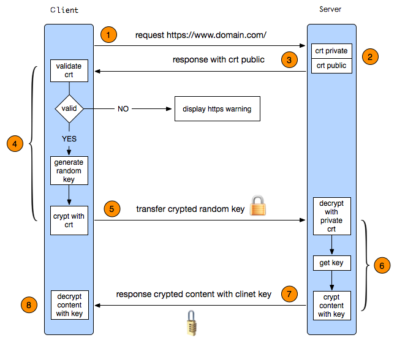

###HTTPS工作原理

HTTPS其实是有两部分组成：HTTP + SSL / TLS

就是在HTTP上又加了一层处理加密信息的模块。服务端和客户端的信息传输都会通过TLS进行加密，所以传输的数据都是加密后的数据

1. 首先HTTP请求服务端生成证书，客户端对证书的有效期、合法性、域名是否与请求的域名一致、证书的公钥（RSA加密）等进行校验；
2. 客户端如果校验通过后，就根据证书的公钥的有效， 生成随机数，随机数使用公钥进行加密（RSA加密）；
3. 消息体产生后，对它的摘要进行MD5（或者SHA1）算法加密，此时就得到了RSA签名；
4. 发送给服务端，此时只有服务端（RSA私钥）能解密。
5. 解密得到的随机数，再用AES加密，作为密钥（此时的密钥只有客户端和服务端知道）。

###一次完整的HTTP请求所经历的7个步骤
建立TCP连接->发送请求行->发送请求头->（到达服务器）发送状态行->发送响应头->发送响应数据->断TCP连接