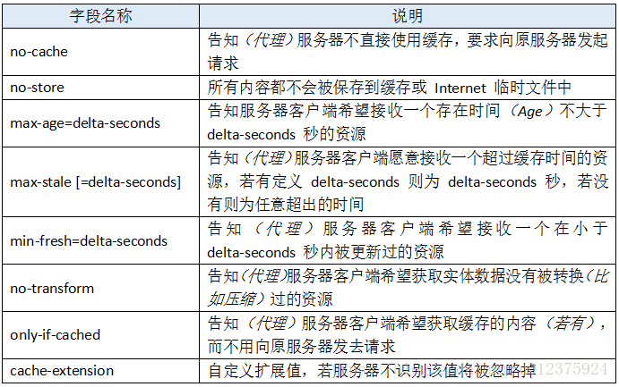
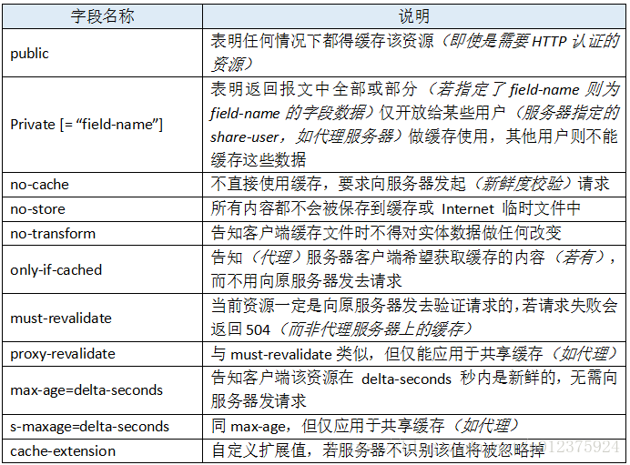

###缓存控制
   
   在http中，控制缓存开关的字段有两个：Pragma 和 Cache-Control。
   
####Pragma

Pragma有两个字段Pragma和Expires。Pragma的值为no-cache时，表示禁用缓存，Expires的值是一个GMT时间，表示该缓存的有效时间。

Pragma是旧产物，已经逐步抛弃，有些网站为了向下兼容还保留了这两个字段。如果一个报文中同时出现Pragma和Cache-Control时，以Pragma为准。同时出现Cache-Control和Expires时，以Cache-Control为准。即优先级从高到低是 Pragma -> Cache-Control -> Expires

####Cache-Control

- 请求中使用Cache-Control 时，它可选的值有：

- 响应中使用Cache-Control 时，它可选的值有：

###no-store优先级最高

在Cache-Control 中，这些值可以自由组合，多个值如果冲突时，也是有优先级的，而no-store优先级最高。

##缓存校验
  
  在缓存中，我们需要一个机制来验证缓存是否有效。比如服务器的资源更新了，客户端需要及时刷新缓存；又或者客户端的资源过了有效期，但服务器上的资源还是旧的，此时并不需要重新发送。缓存校验就是用来解决这些问题的，在http 1.1 中，我们主要关注下Last-Modified 和 etag 这两个字段。

###Last-Modified

服务端在返回资源时，会将该资源的最后更改时间通过Last-Modified字段返回给客户端。客户端下次请求时通过If-Modified-Since或者If-Unmodified-Since带上Last-Modified，服务端检查该时间是否与服务器的最后修改时间一致：如果一致，则返回304状态码，不返回资源；如果不一致则返回200和修改后的资源，并带上新的时间。

- If-Modified-Since和If-Unmodified-Since的区别是：
    - If-Modified-Since：告诉服务器如果时间一致，返回状态码304
    - If-Unmodified-Since：告诉服务器如果时间不一致，返回状态码412

###etag

单纯的以修改时间来判断还是有缺陷，比如文件的最后修改时间变了，但内容没变。对于这样的情况，我们可以使用etag来处理。

etag的方式是这样：服务器通过某个算法对资源进行计算，取得一串值(类似于文件的md5值)，之后将该值通过etag返回给客户端，客户端下次请求时通过If-None-Match或If-Match带上该值，服务器对该值进行对比校验：如果一致则不要返回资源。

- If-None-Match和If-Match的区别是：
    - If-None-Match：告诉服务器如果一致，返回状态码304，不一致则返回资源
    - If-Match：告诉服务器如果不一致，返回状态码412

[参考](https://blog.csdn.net/u012375924/article/details/82806617)