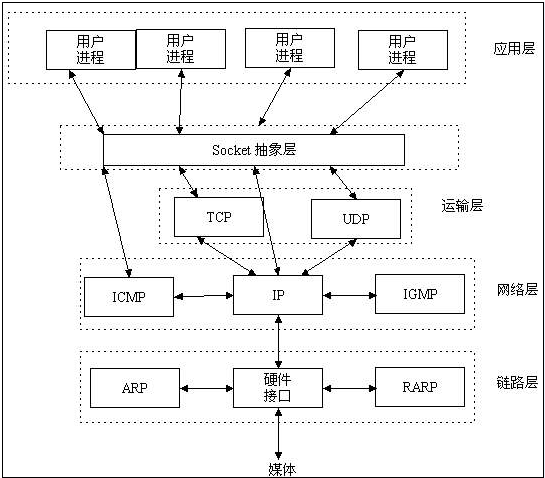

###Socket
- socket通常也称作"套接字"，用于描述IP地址和端口，是一个通信链的句柄。应用程序通常通过"套接字"向网络发出请求或者应答网络请求。
- Socket 其实并不是一个协议。它工作在 OSI 模型会话层（第5层），是为了方便大家直接使用更底层协议（一般是 TCP 或 UDP ）而存在的一个抽象层。
- Socket是应用层与TCP/IP协议族通信的中间软件抽象层，它是一组接口。在设计模式中，Socket其实就是一个门面模式，它把复杂的TCP/IP协议族隐藏在Socket接口后面，对用户来说，一组简单的接口就是全部，让Socket去组织数据，以符合指定的协议。

###websocket
- WebSocket 则不同，它是一个完整的应用层协议，包含一套标准的 API 。
- 所以，从使用上来说，WebSocket 更易用，而 Socket 更灵活。
- 对于 WebSocket 来说，它必须依赖 HTTP 协议进行一次握手 ，握手成功后，数据就直接从 TCP 通道传输，与 HTTP 无关了。
- WebSocket是html5新增加的一种双工通信协议，目前流行的浏览器都支持这个协议
- 连接过程 —— 握手过程
  
  1. 浏览器、服务器建立TCP连接，三次握手。这是通信的基础，传输控制层，若失败后续都不执行。
  2. TCP连接成功后，浏览器通过HTTP协议向服务器传送WebSocket支持的版本号等信息。（开始前的HTTP握手）
  3. 服务器收到客户端的握手请求后，同样采用HTTP协议回馈数据。
  4. 当收到了连接成功的消息后，通过TCP通道进行传输通信。

- WebSocket API 是 HTML5 标准的一部分， 但这并不代表 WebSocket 一定要用在 HTML 中，或者只能在基于浏览器的应用程序中使用。
  
  实际上，许多语言、框架和服务器都提供了 WebSocket 支持，例如：
  
  - 基于 C 的 libwebsocket.org
  - 基于 Node.js 的 Socket.io
  - 基于 Python 的 ws4py
  - 基于 C++ 的 WebSocket++
  - Apache 对 WebSocket 的支持： Apache Module mod_proxy_wstunnel
  - Nginx 对 WebSockets 的支持： NGINX as a WebSockets Proxy 、 NGINX Announces Support for WebSocket Protocol 、WebSocket proxying
  - lighttpd 对 WebSocket 的支持：mod_websocket