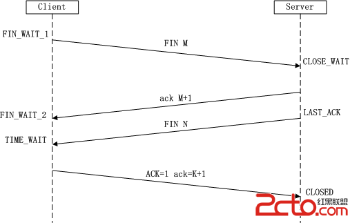
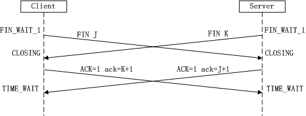

###三次握手
是指建立一个TCP连接时，需要客户端和服务端总共发送3个包以确认连接的建立。在socket编程中，这一过程由客户端执行connect来触发

（1）第一次握手：Client将标志位SYN置为1，随机产生一个值seq=J，并将该数据包发送给Server，Client进入SYN_SENT状态，等待Server确认。

（2）第二次握手：Server收到数据包后由标志位SYN=1知道Client请求建立连接，Server将标志位SYN和ACK都置为1，ack=J+1，随机产生一个值seq=K，并将该数据包发送给Client以确认连接请求，Server进入SYN_RCVD状态。

（3）第三次握手：Client收到确认后，检查ack是否为J+1，ACK是否为1，如果正确则将标志位ACK置为1，ack=K+1，并将该数据包发送给Server，Server检查ack是否为K+1，ACK是否为1，如果正确则连接建立成功，Client和Server进入ESTABLISHED状态，完成三次握手，随后Client与Server之间可以开始传输数据了。

- 客户端：发送J
- 服务端：发送K， 确认J+1
- 客户端：发送J+1（1000），确认K+1（2000）

####包含义
- SYN：代表请求创建连接，所以在三次握手中前两次要SYN=1，表示这两次用于建立连接
- FIN：表示请求关闭连接，在四次分手时，我们发现FIN发了两遍。这是因为TCP的连接是双向的，所以一次FIN只能关闭一个方向。
- ACK：代表确认接受，从上面可以发现，不管是三次握手还是四次分手，在回应的时候都会加上ACK=1，表示消息接收到了，并且在建立连接以后的发送数据时，都需加上ACK=1,来表示数据接收成功。
- seq:序列号，什么意思呢？当发送一个数据时，数据是被拆成多个数据包来发送，序列号就是对每个数据包进行编号，这样接受方才能对数据包进行再次拼接。
    初始序列号是随机生成的，这样不一样的数据拆包解包就不会连接错了。（例如：两个数据都被拆成1，2，3和一个数据是1，2，3一个是101，102，103，很明显后者不会连接错误）
- ack:这个代表下一个数据包的编号，这也就是为什么第二请求时，ack是seq+1，

###四次挥手
是指断开一个TCP连接时，需要客户端和服务端总共发送4个包以确认连接的断开。在socket编程中，这一过程由客户端或服务端任一方执行close来触发

- 一方主动关闭，另一方被动关闭的情况

（1）第一次挥手：Client发送一个FIN，用来关闭Client到Server的数据传送，Client进入FIN_WAIT_1状态。

（2）第二次挥手：Server收到FIN后，发送一个ACK给Client，确认序号为收到序号+1（与SYN相同，一个FIN占用一个序号），Server进入CLOSE_WAIT状态。

（3）第三次挥手：Server发送一个FIN，用来关闭Server到Client的数据传送，Server进入LAST_ACK状态。

（4）第四次挥手：Client收到FIN后，Client进入TIME_WAIT状态，接着发送一个ACK给Server，确认序号为收到序号+1，Server进入CLOSED状态，完成四次挥手。

- 同时发起主动关闭

###为什么建立连接是三次握手，而关闭连接却是四次挥手呢？

- 三次握手：主要目的防止在网络发生延迟或者丢包的情况下浪费资源。
- 为什么两次握手不行：两次握手可能因为丢包而出现死锁，假设在两次握手场景中，C向S发送请求，S收到并发送确认请求给C，这时候S认为连接已经建立，并开始发送数据给C，但是那个确认请求丢包了，C不认为请求建立了，C当然会拒绝接受S发送来的数据，并且再去请求连接。这样，一个资源就死锁了

- 为什么四次挥手，因为tcp是全双工模式，接收到FIN时意味将没有数据再发来，但是还是可以继续发送数据

###滑动窗口
- TCP 中采用滑动窗口来进行传输控制，滑动窗口的大小意味着接收方还有多大的缓冲区可以用于接收数据。发送方可以通过滑动窗口的大小来确定应该发送多少字节的数据。当滑动窗口为 0 时，发送方一般不能再发送数据报，但有两种情况除外，一种情况是可以发送紧急数据，例如，允许用户终止在远端机上的运行进程。另一种情况是发送方可以发送一个 1 字节的数据报来通知接收方重新声明它希望接收的下一字节及发送方的滑动窗口大小。

###流量控制
- 流量控制是为了控制发送方发送速率，保证接收方来得及接收
- 接收方发送的确认报文中的窗口字段可以用来控制发送方窗口大小，从而影响发送方的发送速率。将窗口字段设置为 0，则发送方不能发送数据。

###拥塞控制
- 在某段时间，若对网络中某一资源的需求超过了该资源所能提供的可用部分，网络的性能就要变坏。这种情况就叫拥塞。
- 拥塞控制就是为了防止过多的数据注入到网络中，这样就可以使网络中的路由器或链路不致过载。
- 拥塞控制所要做的都有一个前提，就是网络能够承受现有的网络负荷。
- 拥塞控制是一个全局性的过程，涉及到所有的主机，所有的路由器，以及与降低网络传输性能有关的所有因素。
- 相反，流量控制往往是点对点通信量的控制，是个端到端的问题。
- 流量控制所要做到的就是抑制发送端发送数据的速率，以便使接收端来得及接收。
  
- 为了进行拥塞控制，TCP 发送方要维持一个 拥塞窗口(cwnd) 的状态变量。
- 拥塞控制窗口的大小取决于网络的拥塞程度，并且动态变化。
- 发送方让自己的发送窗口取为拥塞窗口和接收方的接受窗口中较小的一个。

###TCP的拥塞控制采用了四种算法，即 慢开始 、 拥塞避免 、快重传 和 快恢复。
在网络层也可以使路由器采用适当的分组丢弃策略（如主动队列管理 AQM），以减少网络拥塞的发生。

- **慢开始：** 慢开始算法的思路是当主机开始发送数据时，如果立即把大量数据字节注入到网络，那么可能会引起网络阻塞，因为现在还不知道网络的符合情况。经验表明，较好的方法是先探测一下，即由小到大逐渐增大发送窗口，也就是由小到大逐渐增大拥塞窗口数值。cwnd初始值为1，每经过一个传播轮次，cwnd加倍。
   

- **拥塞避免：** 拥塞避免算法的思路是让拥塞窗口cwnd缓慢增大，即每经过一个往返时间RTT就把发送放的cwnd加1.

-  **快重传与快恢复：**
   在 TCP/IP 中，快速重传和恢复（fast retransmit and recovery，FRR）是一种拥塞控制算法，它能快速恢复丢失的数据包。没有 FRR，如果数据包丢失了，TCP 将会使用定时器来要求传输暂停。在暂停的这段时间内，没有新的或复制的数据包被发送。有了 FRR，如果接收机接收到一个不按顺序的数据段，它会立即给发送机发送一个重复确认。如果发送机接收到三个重复确认，它会假定确认件指出的数据段丢失了，并立即重传这些丢失的数据段。有了 FRR，就不会因为重传时要求的暂停被耽误。 　当有单独的数据包丢失时，快速重传和恢复（FRR）能最有效地工作。当有多个数据信息包在某一段很短的时间内丢失时，它则不能很有效地工作。
 

#### 简单邮件传输协议(SMTP)：
     SMTP（Simple Mail Transfer Protocol）即简单邮件传输协议,它是一组用于由源地址到目的地址传送邮件的规则，由它来控制信件的中转方式。
     SMTP协议属于TCP/IP协议簇，它帮助每台计算机在发送或中转信件时找到下一个目的地。
     通过SMTP协议所指定的服务器,就可以把E-mail寄到收信人的服务器上了，整个过程只要几分钟。SMTP服务器则是遵循SMTP协议的发送邮件服务器，用来发送或中转发出的电子邮件。
