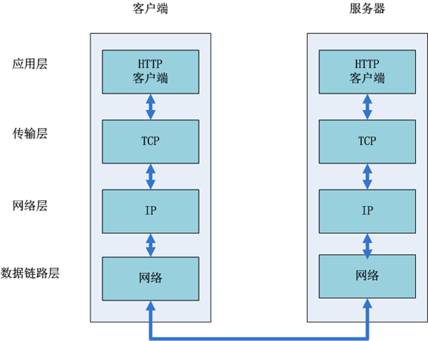

###从输入URL到浏览器显示页面发生了什么

###[参考](http://www.ituring.com.cn/article/506680)

###一、网络通信

1. 在浏览器中输入url

    用户输入url，例如http://www.baidu.com。其中http为协议，www.baidu.com为网络地址，及指出需要的资源在那台计算机上。一般网络地址可以为域名或IP地址，此处为域名。使用域名是为了方便记忆，但是为了让计算机理解这个地址还需要把它解析为IP地址。

2. 应用层DNS解析域名

   客户端先检查本地是否有对应的IP地址，若找到则返回响应的IP地址。若没找到则请求上级DNS服务器，直至找到或到根节点。

3. 应用层客户端发送HTTP请求

   HTTP请求包括请求报头和请求主体两个部分，其中请求报头包含了至关重要的信息，包括请求的方法（GET / POST）、目标url、遵循的协议（http / https / ftp…），返回的信息是否需要缓存，以及客户端是否发送cookie等。

4. 传输层TCP传输报文

   位于传输层的TCP协议为传输报文提供可靠的字节流服务。它为了方便传输，将大块的数据分割成以报文段为单位的数据包进行管理，并为它们编号，方便服务器接收时能准确地还原报文信息。TCP协议通过“三次握手”等方法保证传输的安全可靠。
   
5. 网络层IP协议查询MAC地址

   IP协议的作用是把TCP分割好的各种数据包传送给接收方。而要保证确实能传到接收方还需要接收方的MAC地址，也就是物理地址。IP地址和MAC地址是一一对应的关系，一个网络设备的IP地址可以更换，但是MAC地址一般是固定不变的。ARP协议可以将IP地址解析成对应的MAC地址。当通信的双方不在同一个局域网时，需要多次中转才能到达最终的目标，在中转的过程中需要通过下一个中转站的MAC地址来搜索下一个中转目标。

6. 数据到达数据链路层

   在找到对方的MAC地址后，就将数据发送到数据链路层传输。这时，客户端发送请求的阶段结束

7. 服务器接收数据

   接收端的服务器在链路层接收到数据包，再层层向上直到应用层。这过程中包括在运输层通过TCP协议讲分段的数据包重新组成原来的HTTP请求报文。

8. 服务器响应请求

   服务接收到客户端发送的HTTP请求后，查找客户端请求的资源，并返回响应报文，响应报文中包括一个重要的信息——状态码。状态码由三位数字组成，其中比较常见的是200 OK表示请求成功。301表示永久重定向，即请求的资源已经永久转移到新的位置。在返回301状态码的同时，响应报文也会附带重定向的url，客户端接收到后将http请求的url做相应的改变再重新发送。404 not found 表示客户端请求的资源找不到。

9. 服务器返回相应文件

   请求成功后，服务器会返回相应的HTML文件。接下来就到了页面的渲染阶段了。
   
###二、页面渲染

   