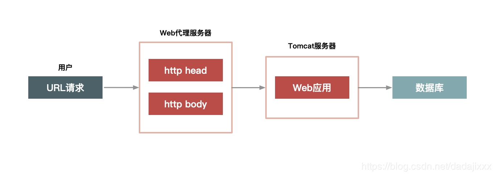
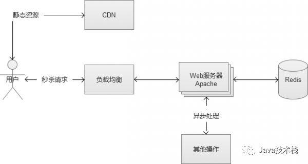

###如何打造并维护一个超大流量并发读写、高性能、高可用系统
1.高性能

支持高并发访问，主要四个方面来做优化

（1）数据的动静分离方案 

（2）热点的发现与隔离 

（3）请求的削峰与分层过滤 

（4）服务端的极致优化

2.一致性

秒杀商品的减库存，保证数据的一致性。有限的商品会在某一时刻被大量请求同时减库存，并且减库存的方案也有多种。

3.高可用

瞬时大并发场景
保证系统的高可用和确定性，还要准备一个planB

###方法
1、前端三板斧【扩容】【限流】【静态化】

2、后端两条路【内存】+【排队】

##前端

###如何做好数据的动静分离，关键点与方案
1.把数据缓存在离用户最近的地方

用户浏览器中，CDN，服务器Cache中

2.静态化改造就是要直接缓存HTTP连接而不是仅仅缓存数据

如下图所示，Web 代理服务器根据请求 URL，直接取出对应的 HTTP 响应头和响应体然后直接返回，这个响应过程简单得连 HTTP 协议都不用重新组装，甚至连 HTTP 请求头也不需要解析。

3.用什么来缓存，不同的语言特点不同，java并不擅长处理大量请求连接,servlet容器解析http协议较慢，我们可以在web服务器层上做，如Ngnix、Apache、Varnish

##后端

###请求接口的合理设计
- 一个秒杀或者抢购页面，通常分为2个部分，一个是静态的HTML等内容，另一个就是参与秒杀的Web后台请求接口。

###高并发下的数据安全
- 解决超买超卖
    - 乐观锁，是相对于“悲观锁”采用更为宽松的加锁机制，大都是采用带版本号（Version）更新。

    - 实时库存的扣减在缓存中进行，异步扣减数据库中的库存，保证缓存中和数据库中库存的最终一致性。

    - 因为redis是单线程写，所以也不用担心线程安全的问题，redis自身就能够保证数据的强一致性，在下单的事务中包含了实时扣减缓存中的库存和异步发送队列，由队列处理器再异步从队列中取出订单根据订单信息扣减库存系统数据库中的商品数量。

