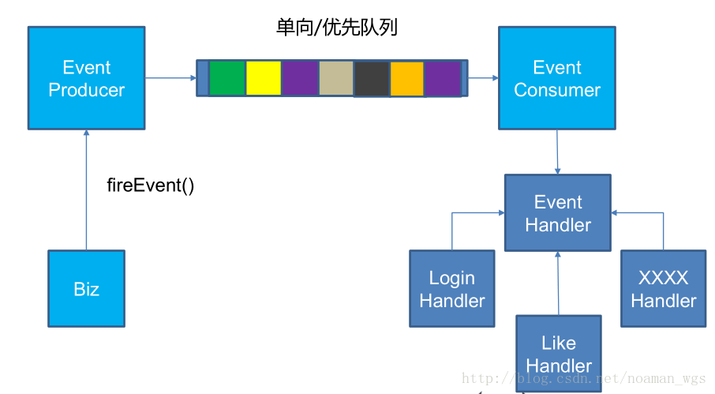

###Nginx

####请解释一下什么是Nginx?
Nginx是一个web服务器和反向代理服务器，用于HTTP、HTTPS、SMTP、POP3和IMAP协议。

####请列举Nginx的一些特性？
1. 反向代理/L7负载均衡器 

2. 嵌入式Perl解释器 

3. 动态二进制升级 

4. 可用于重新编写URL，具有非常好的PCRE支持

####nginx和apache的区别
1. 轻量级，同样是web 服务，比apache占用更少的内存及资源

2. 抗并发，nginx 处理请求是异步非阻塞的，而apache 则是阻塞型的，在高并发下nginx 能保持低资源低消耗高性能

3. 高度模块化的设计，编写模块相对简单 

4. 最核心的区别在于apache是同步多进程模型，一个连接对应一个进程；nginx是异步的，多个连接（万级别）可以对应一个进程

####nginx是如何实现高并发的
一个主进程，多个工作进程，每个工作进程可以处理多个请求，每进来一个request，会有一个worker进程去处理。但不是全程的处理，处理到可能发生阻塞的地方，比如向上游（后端）服务器转发request，并等待请求返回。那么，这个处理的worker继续处理其他请求，而一旦上游服务器返回了，就会触发这个事件，worker才会来接手，这个request才会接着往下走。

####请解释Nginx如何处理HTTP请求
Nginx使用反应器模式。主事件循环等待操作系统发出准备事件的信号，这样数据就可以从套接字读取，在该实例中读取到缓冲区并进行处理。单个线程可以提供数万个并发连接

####nginx的好处
- 真实的服务器不能直接被外部网络访问,想要访问必须通过代理。
- 防止主服务器被恶意攻击
- 为负载均衡和动静分离提供实现支持

##redis分布式锁
首先，为了确保分布式锁可用，我们至少要确保锁的实现同时满足以下四个条件：

1. 互斥性。在任意时刻，只有一个客户端能持有锁。
2. 不会发生死锁。即使有一个客户端在持有锁的期间崩溃而没有主动解锁，也能保证后续其他客户端能加锁。
3. 具有容错性。只要大部分的Redis节点正常运行，客户端就可以加锁和解锁。
4. 解铃还须系铃人。加锁和解锁必须是同一个客户端，客户端自己不能把别人加的锁给解了。

###保证设置锁和设置超期时间的原子性
```$xslt
if redis.call('setnx',KEYS[1],ARGV[1]) == 1 
then  
    return redis.call('expire',KEYS[1],ARGV[2])  
else 
    return 0 
end
```

###防止错误删除锁
- 根本问题还是保证操作的原子性，因为是两步操作，即便判断到是当前线程的锁，但是也有可能再删除之前刚好过期，这样删除的就是其他线程的锁。

- 保证加锁和删除锁是同一个线程
- 使用lua脚本
```$xslt
//key表示锁名称，argv表示请求ID
if redis.call("get", KEYS[1]) == ARGV[1]
then
    return redis.call("del", KEYS[1])
else
    return 0
end
```

##redis赞踩功能
使用集合的sadd和srem来完成时，首先我们需要创建两个集合，一个赞集合，一个踩集合

- 点赞时：向赞集合添加该用户，删除踩集合中的该用户
- 踩时：向踩集合添加该用户，删除赞集合中的该用户

判断是否赞踩
- SISMEMBER key member 
- 判断 member 元素是否是集合 key 的成员

##关注，粉丝，浏览量
添加关注
- ZADD key score1 member1 [score2 member2] 
- 向有序集合添加一个或多个成员，或者更新已存在成员的分数

```$xslt
        Jedis jedis = jedisAdapter.getJedis();
        Transaction tx = jedisAdapter.multi(jedis);
        // 实体的粉丝增加当前用户
        tx.zadd(followerKey, date.getTime(), String.valueOf(userId));
        // 当前用户对这类实体关注+1
        tx.zadd(followeeKey, date.getTime(), String.valueOf(entityId));
        List<Object> ret = jedisAdapter.exec(tx, jedis);
```
取消关注
- ZREM key member [member ...] 
- 移除有序集合中的一个或多个成员

```$xslt
        Jedis jedis = jedisAdapter.getJedis();
        Transaction tx = jedisAdapter.multi(jedis);
        // 实体的粉丝移除当前用户
        tx.zrem(followerKey, String.valueOf(userId));
        // 当前用户对这类实体关注-1
        tx.zrem(followeeKey, String.valueOf(entityId));
        List<Object> ret = jedisAdapter.exec(tx, jedis);
```

获取关注或粉丝
- ZREVRANGE key start stop [WITHSCORES] 
- 返回有序集中指定区间内的成员，通过索引，分数从高到底

判断是否是粉丝
- ZSCORE key member 
- 返回有序集中，成员的分数值

##浏览量
字符串
- SET key value 
- 设置指定 key 的值
- GET key 
- 获取指定 key 的值。

##redis异步消息队列


- EventProducer将事件推送到消息队列中：lpush 
- EventConsumer监听队列，只要监测到有事件到达，使用brpop阻塞的从列表中取出消息，交给对应的Handler进行处理。

####1. 定义事件类型 -- 定义Enum类 -- EnumType

- 用于表示该事件的类型

####2. 定义事件的实体 -- EventModel

- 这里说明一下entityOwnerId的必要性。举个例子，当我们给一个人点赞时，系统要给那个人（也就是entityOwnerId）发送一个站内信，通知那个人他被点赞了。当然，我们也可以把entityOwnerId包装在exts里，但因为几乎每一个事件都需要这个字段，所以这里我们开一个字段给他。

####3. 生产者的实现 -- EventProducer

- 这里的队列我们使用Redis的阻塞双向队列list来实现。
若不设置阻塞，若list为空，消费者就需要轮询来获取数据，这样就会增加resis的访问压力，增加消费端的cpu时间，而很多访问都是无用的，
为此redis提供了阻塞式访问BPPOP命令，消费者可以在获取数据时指定数据不存在时阻塞的时间，
如果在时限内获得数据则立即返回，若超时还没有数据则返回null，超时时间为0表示一直阻塞。

- a) 我们先用JSON把事件序列化
- b) 再通过lpush把事件推进队列里

####4. 定义一个事件处理器的接口 -- EventHandler

####5. 消费者的实现 -- EventConsumer

- a）创建一个类型为Map<EventType, List<EventHandler>>的map，用于存放所有的Handler。
- b）在afterPropertiesSet函数中（这个函数在sping在初始化完该Bean后会执行），我们通过applicationContext获取实现了EventHandler接口的全部Handler。
    - b.1）通过for循环，分门别类的把各个Handler放到map中。
    - b.2）启动线程去消化事件
        - b.2.1）该线程使用死循环让其不间断的运行。
        - b.2.2）用brpop把事件拉出来
        - b.2.3）过滤掉key之后，剩下value，把value用JSON的api转化为EventModel
        - b.2.4）在map中寻找是否有能处理EventModel的Handler，判断方法是看EventType是否支持。
        - b.2.5）过滤掉不支持的EventType之后，调用每一个支持该EventType的doHandle方法。


  
  

