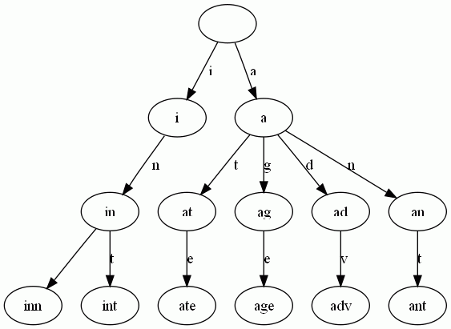

###Trie树是简单但实用的数据结构，通常用于实现字典查询。
- 字典树又称单词查找树，它是一种树形结构，是一种哈希树的变种，典型应用是用于统计，保存大量的字符串（但不仅限于字符串），统计以是否有以某字符串最为前缀的字符串，有的话有多少，某字符串出现了多少次等，所以经常被搜索引擎系统用于文本词频统计。

- 本质上，Trie是一颗存储多个字符串的树。
相邻节点间的边代表一个字符，这样树的每条分支代表一则子串，而树的叶节点则代表完整的字符串。和普通树不同的地方是，相同的字符串前缀共享同一条分支。

- 每条边对应一个字母。
- 每个节点对应一项前缀。叶节点对应最长前缀，即单词本身。
- 单词inn与单词int有共同的前缀“in”, 因此他们共享左边的一条分支，root->i->in。同理，ate, age, adv, 和ant共享前缀"a"，所以他们共享从根节点到节点"a"的边。
    
- 查询操纵非常简单。比如要查找int，顺着路径i -> in -> int就找到了。

- 搭建Trie的基本算法也很简单，无非是逐一把每则单词的每个字母插入Trie。插入前先看前缀是否存在。如果存在，就共享，否则创建对应的节点和边。比如要插入单词add，就有下面几步：
    - 考察前缀"a"，发现边a已经存在。于是顺着边a走到节点a。
    - 考察剩下的字符串"dd"的前缀"d"，发现从节点a出发，已经有边d存在。于是顺着边d走到节点ad
    - 考察最后一个字符"d"，这下从节点ad出发没有边d了，于是创建节点ad的子节点add，并把边ad->add标记为d。

###在建立Trie树时同时进行统计！

- 可用于查询每个字符串出现的次数
