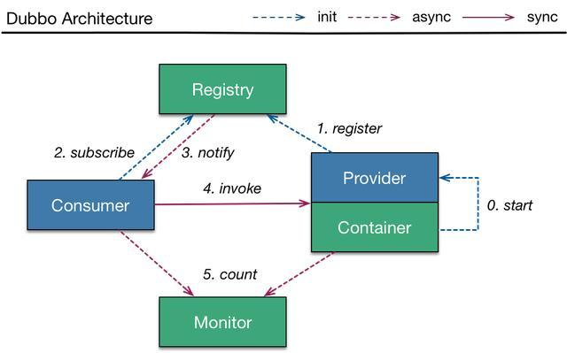
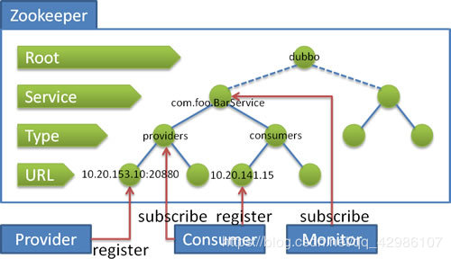

###智能立体车库停车系统后台
####项目描述：
立体车库智能停车系统，包含智能硬件、云平台、云门户三大模块，实现车库查询、车位预约、导航、在线存取车、在线支付等功能
####主要技术点：
- 前期后端采用Apache+PHP+MySQL架构，设计基于HTTPS协议的RESTful的API接口，部署至阿里云服务器，
- 2018年10月，重构后端服务器代码，采用Dubbo+SpringBoot架构
- 使用Zookeeper作为注册中心，实现服务的注册和发现功能
- 使用Dubbo分布式框架，提供RPC远程服务调用，包括用户服务，车库服务和订单服务
- 采用Java ORM框架MyBatis操作数据库
- 同时利用MyBatis Generator进行数据层代码自动生成
- 使用Redis分布式锁来实现车库车位数量的共享调用
- 项目使用Git协同开发
- 客户端包括网站(Bootstrap框架)、微信小程序、安卓APP以及IOS APP，现已上线

- 关键词：Dubbo、RPC、Redis分布式锁、SpringBoot、RESTful API、Git

###RESTful接口
- restful其实就是一套编写接口的协议，协议规定如何编写以及如何设置返回值、状态码等信息。
- REST的名称"表现层状态转化"中，省略了主语。"表现层"其实指的是"资源"（Resources）的"表现层"。
  所谓"资源"，就是网络上的一个实体，或者说是网络上的一个具体信息。它可以是一段文本、一张图片、一首歌曲、一种服务，总之就是一个具体的实在。你可以用一个URI（统一资源定位符）指向它，每种资源对应一个特定的URI。要获取这个资源，访问它的URI就可以，因此URI就成了每一个资源的地址或独一无二的识别符。

###Dubbo
- Dubbo是一个由阿里巴巴开源的、分布式的RPC(Remote Procedure Call Protocol-远程过程调用)和微服务框架，现为Apache顶级项目。
- Dubbo提供了三个关键功能：
    - 基于接口的远程调用
    - 容错与负载均衡
    - 服务自动注册与发现
    

- 服务是围绕服务提供方和服务消费方的，服务提供方实现服务，而服务消费方调用服务。       

- 支持四种注册中心（管理服务）
    - 官方(Dubbo注册中心)推荐使用 zookeeper注册中心。注册中心负责服务地址的注册与查找，相当于目录服务，服务提供者和消费者只在启动时与注册中心交互，注册中心不转发请求，压力较小。     
    - Zookeeper 是 Apacahe Hadoop 的子项目，是一个树型的目录服务，支持变更推送，适合作为Dubbox 服务的注册中心，工业强度较高，可用于生产环境。

####为什么选择zookeeper做注册中心?
- Zookeeper的数据模型很简单，有一系列被称为ZNode的数据节点组成，
- 高性能，与传统的磁盘文件系统不同的是，zk将全量数据存储在内存中
- 高可用，支持集群
- 支持事件监听

这些特点决定了zk特别适合作为注册中心(数据发布/订阅)。

####zookeeper的优势
1. 当提供程序意外停止时，注册表服务器可以自动删除其信息。
2. 注册表服务器重新启动时，可以自动恢复所有注册数据和订阅请求。
3. 会话过期后，可以自动恢复所有注册数据和订阅请求。

###Redis注册中心
- 使用Redis的Key/Map结构存储数据。
       主Key为服务名和类型。
       Map中的Key为URL地址。
       Map中的Value为过期时间
       
####redis注册中心存在的问题
1. 服务的非自然下线需要监护中心来维护
2. redis做注册中心服务器时间必需同步，否则出现时间不对被强制过期(删除key)!
3. zookeeper支持监听，redis不支持，因此需要客户端启动多个线程进行订阅监听，对服务器有一定压力!

###Dubbo用到的模式

- 观察者模式
    - Dubbo中使用观察者模式最典型的例子是RegistryService。消费者在初始化的时候回调用subscribe
    方法，注册一个观察者，如果观察者引用的服务地址列表发生改变，就会通过NotifyListener通知消费者。
    此外，Dubbo的InvokerListener、ExporterListener 也实现了观察者模式，只要实现该接口，并注册，
    就可以接收到consumer端调用refer和provider端调用export的通知。Dubbo的注册/订阅模型和观察者
    模式就是天生一对。
    
###Reactor模式
- 一种为处理并发服务请求，并将请求提交到一个或者多个服务处理程序的事件设计模式
- Reactor模式是事件驱动模型，有一个或多个并发输入源，有一个Service Handler，有多个Request Handlers；这个Service Handler会同步的将输入的请求（Event）多路复用的分发给相应的Request Handler。从结构上，这有点类似生产者消费者模式，即有一个或多个生产者将事件放入一个Queue中，而一个或多个消费者主动的从这个Queue中Poll事件来处理；而Reactor模式则并没有Queue来做缓冲，每当一个Event输入到Service Handler之后，该Service Handler会主动的根据不同的Event类型将其分发给对应的Request Handler来处理

###zookeeper
- ZooKeeper是一个分布式的，开放源码的分布式应用程序协调服务，是Google的Chubby一个开源的实现，
- 它是集群的管理者，监视着集群中各个节点的状态，根据节点提交的反馈进行下一步合理操作。最终，将简单易用的接口和性能高效、功能稳定的系统提供给用户。
- 随着zookeeper的集群机器增多，读请求的吞吐会提高但是写请求的吞吐会下降
- 有序性是zookeeper中非常重要的一个特性，所有的更新都是全局有序的，每个更新都有一个唯一的时间戳，这个时间戳称为zxid（Zookeeper Transaction Id）。而读请求只会相对于更新有序，也就是读请求的返回结果中会带有这个zookeeper最新的zxid。

####Zookeeper工作原理
- Zookeeper 的核心是原子广播，这个机制保证了各个Server之间的同步。实现这个机制的协议叫做Zab协议。Zab协议有两种模式，它们分别是恢复模式（选主）和广播模式（同步）。当服务启动或者在领导者崩溃后，Zab就进入了恢复模式，当领导者被选举出来，且大多数Server完成了和 leader的状态同步以后，恢复模式就结束了。状态同步保证了leader和Server具有相同的系统状态。

####ZooKeeper提供了什么？
- 文件系统
    - Zookeeper提供一个多层级的节点命名空间（节点称为znode）。与文件系统不同的是，这些节点都可以设置关联的数据，而文件系统中只有文件节点可以存放数据而目录节点不行。Zookeeper为了保证高吞吐和低延迟，在内存中维护了这个树状的目录结构，这种特性使得Zookeeper不能用于存放大量的数据，每个节点的存放数据上限为1M。
- 通知机制
    - client端会对某个znode建立一个watcher事件，当该znode发生变化时，这些client会收到zk的通知，然后client可以根据znode变化来做出业务上的改变等。

####Zookeeper应用
1、命名服务
2、配置管理
3、集群管理
4、分布式锁
5、队列管理

####选举机制
- FastLeaderElection
