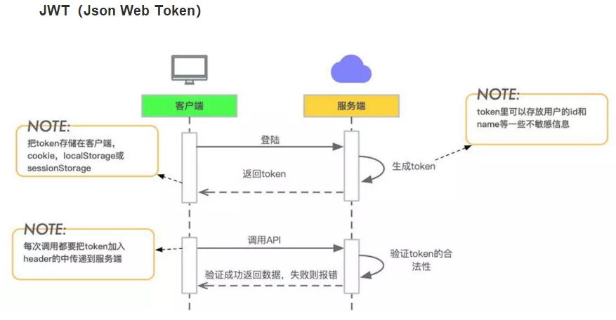
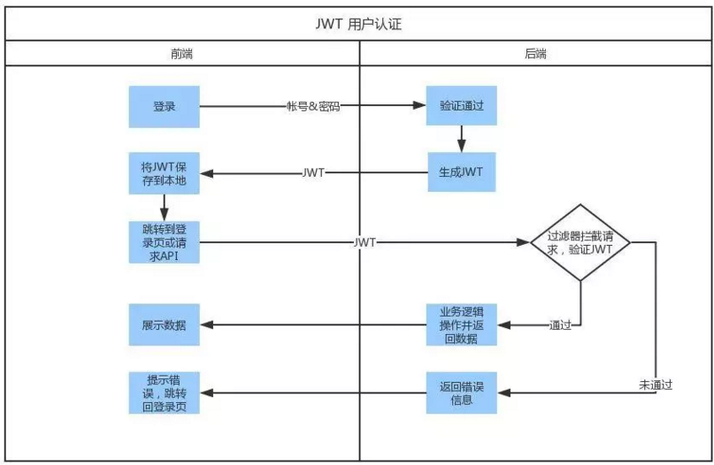
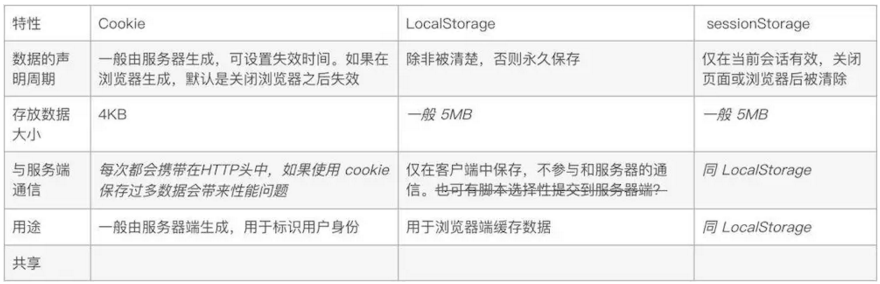

###用户登录认证

- 使用JWT（Json Web Token）方案

###JWT 组成
JWT由3个子字符串组成，分别为Header，Payload以及Signature，结合JWT的格式即：Header.Payload.Signature。（Claim是描述Json的信息的一个Json，将Claim转码之后生成Payload）。 

###JWT认证
服务器在生成一个JWT之后会将这个token发送到客户端机器，
在客户端再次访问受到JWT保护的资源URL链接的时候，
服务器会获取到这个token信息，首先将Header进行反编码获取到加密的算法，
在通过存放在服务器上的密匙对Header.Payload 这个字符串进行加密，
比对token中的Signature和实际加密出来的结果是否一致，
如果一致那么说明该token是合法有效的，认证成功，否则认证失败。

###JWT使用总结
1. 首先，前端通过Web表单将自己的用户名和密码发送到后端的接口。
这一过程一般是一个HTTP POST请求。建议的方式是通过SSL加密的传输（https协议），
从而避免敏感信息被嗅探。

2. 后端核对用户名和密码成功后，将用户的id等其他信息作为JWT Payload（负载），
将其与头部分别进行Base64编码拼接后签名，形成一个JWT。
形成的JWT就是一个形同lll.zzz.xxx的字符串。

3. 后端将JWT字符串作为登录成功的返回结果返回给前端。
前端可以将返回的结果保存在Cookie或localStorage或sessionStorage上，
退出登录时前端删除保存的JWT即可。
   
4. 前端在每次请求时将JWT放入HTTP Header中的Authorization位。(解决XSS和XSRF问题)    

5. 后端检查是否存在，如存在验证JWT的有效性。例如，检查签名是否正确；
检查Token是否过期；检查Token的接收方是否是自己（可选）。    

6. 验证通过后后端使用JWT中包含的用户信息进行其他逻辑操作，返回相应结果。

###Cookie、LocalStorage、sessionStorage

###JWT和Session方式存储id的差异

- Session方式存储用户id的最大弊病在于Session是存储在服务器端的，
所以需要占用大量服务器内存，对于较大型应用而言可能还要保存许多的状态。
一般而言，大型应用还需要借助一些KV数据库和一系列缓存机制来实现Session的存储。

- 而JWT方式将用户状态分散到了客户端中，可以明显减轻服务端的内存压力。
除了用户id之外，还可以存储其他的和用户相关的信息，
例如该用户是否是管理员、用户所在的分组等。
虽说JWT方式让服务器有一些计算压力（例如加密、编码和解码），
但是这些压力相比磁盘存储而言可能就不算什么了。

###单点登录
- Session方式来存储用户id，一开始用户的Session只会存储在一台服务器上。
对于有多个子域名的站点，每个子域名至少会对应一台不同的服务器，
例如：www.taobao.com，nv.taobao.com，nz.taobao.com，login.taobao.com。
所以如果要实现在login.taobao.com登录后，在其他的子域名下依然可以取到Session，
这要求我们在多台服务器上同步Session。

- 使用JWT的方式则没有这个问题的存在，因为用户的状态已经被传送到了客户端。

   

